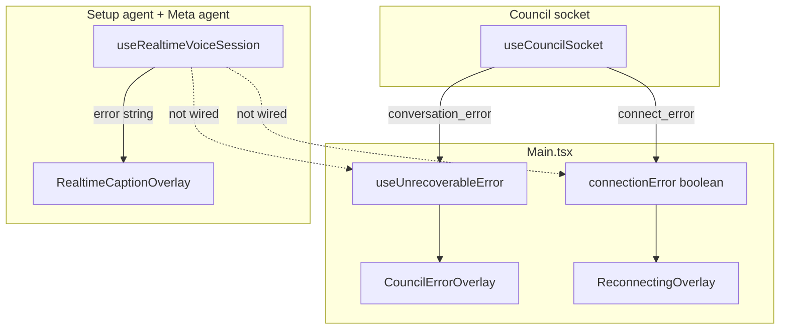

# Agent error handling — integration plan

Integrate **setup agent** and **meta agent** realtime failures into the app's
main **connection error** and **unrecoverable error** systems. Today these agents
use a separate local error string rendered as red caption text, with no retries
and no client reporting.

**Status:** In progress — partial implementation on `foods-leo` / `forest-leo`.

**Related docs:** [museum-kiosk-resilience-plan.md](./museum-kiosk-resilience-plan.md) (kiosk reload / deploy recovery).

### Already shipped (not complete)

| Piece | Location |
|-------|----------|
| `RealtimeHttpError`, `classifyRealtimeError` | `client/src/realtime/realtimeConnection.ts` |
| Retry loop on transient failures | `client/src/realtime/useRealtimeVoiceSession.ts` |
| Some fatal paths → `setUnrecoverableError` | `client/src/museum/metaAgent/useMetaAgent.ts` |

Still open per goals below: unified overlay wiring, museum `Reconnecting` integration,
removing caption red-alert error UI, client reporting for all agent fatals.

---

## Goals

1. **Fatal server errors** (retrying won't help) → `setUnrecoverableError` on
   both web and museum. Goes through the existing `reportTerminalError` →
   `/api/client-report` pipeline.
2. **Transient connection failures** → retry with intelligent backoff; behavior
   differs by mode and agent criticality.
3. **Web mode** — agent is a bonus. Silent background retry (up to 3 attempts);
   corner icon keeps spinning; then return to clickable idle for manual retry.
4. **Museum mode** — agent is app-critical. Infinite background retry with
   backoff; surface `Reconnecting` only when the failure affects UX.
5. **Remove** the parallel agent error UI (caption red-alert) and dead code
   around it.

---

## Background: two error worlds today



| System | State owner | UI | Reporting |
|--------|-------------|-----|-----------|
| Council socket | `Main.tsx` | `Reconnecting` / `CouncilError` | `setUnrecoverableError` |
| Realtime agents | `useRealtimeVoiceSession` | Red text in `RealtimeCaptionOverlay` | None |

---

## Criticality by mode

| Agent | Web | Museum |
|-------|-----|--------|
| Setup agent (meeting setup) | Bonus — silent retry, no overlay | Critical — connection error overlay |
| Meta agent (meeting) | Not mounted | Critical — deferred connection error |

Mode is determined by `isMuseumMode` from `useCouncilSettings()` (`localStorage`
key `councilAppMode`).

---

## Error classification

Colocate in `realtimeConnection.ts` (no separate `realtimeRetry.ts`):

- `RealtimeHttpError extends Error { readonly status: number }` — thrown when
  bootstrap or SDP exchange returns a non-OK response.
- `classifyRealtimeError(err, { isMuseumMode })` — pure function, same file.

| Kind | Examples |
|------|----------|
| **fatal** | HTTP 400, 401, 403, 404, 422; invalid bootstrap shape; mic `NotAllowedError` on **web** |
| **retryable** | HTTP 5xx; network/timeout; `AbortError` (ICE timeout); `pc_failed`, `dc_error`; provider `error` event; mic `NotFoundError`; mic `NotAllowedError` on **museum** |

**500 is retryable** — transient provider blips should not immediately terminal
the app. Persistent 500s are handled by retry exhaustion (web) or the museum
2-minute reload (connection error overlay).

Tests extend the existing `client/tests/unit/realtime/realtimeConnection.test.ts`.

---

## Backoff strategy

The server has `withNetworkRetry` in `server/src/utils/NetworkUtils.ts` — fixed
1 s delay, 3 attempts, Node-specific error codes (`ECONNRESET`, etc.). That is
appropriate for tight server-to-provider HTTP calls with a 30 s timeout. It is
**not** reused on the client.

The client already uses exponential backoff with cap in
`client/src/museum/button/buttonBridge.ts`:

```
delay = min(BASE * 2^attempt, MAX)
BASE = 500ms, MAX = 10_000ms
```

For realtime agent reconnect we use **full jitter** (AWS recommendation for
many concurrent clients, e.g. museum kiosks after a server restart):

```
delay = random(0, min(MAX, BASE * 2^attempt))
BASE = 1_000ms, MAX = 15_000ms
```

| Attempt | Delay range |
|---------|-------------|
| 0 | 0 – 1 s |
| 1 | 0 – 2 s |
| 2 | 0 – 4 s |
| 3 | 0 – 8 s |
| 4+ | 0 – 15 s (capped) |

Reset attempt counter after a stable `ready` connection. Mid-session drop
(`pc_failed`, `dc_error`) starts a fresh retry sequence.

Backoff constants and `computeRealtimeRetryDelay(attempt)` also live in
`realtimeConnection.ts` — pure helpers, only used by `useRealtimeVoiceSession`.
No separate retry module.

---

## Retry engine (`useRealtimeVoiceSession`)

New types and a shared policy helper (exported from the same file as the hook):

```ts
export type RealtimeRetryPolicy = {
  maxRetries: number;        // 3 web, Infinity museum
  giveUpSilently: boolean;   // true web, false museum
};

/** Single place for web vs museum policy — used by both agent wrappers. */
export function getRealtimeRetryPolicy(critical: boolean): RealtimeRetryPolicy {
  return critical
    ? { maxRetries: Infinity, giveUpSilently: false }
    : { maxRetries: 3, giveUpSilently: true };
}
```

New optional hook params:

```ts
retryPolicy?: RealtimeRetryPolicy;
onFatalError?: (e: { message: string; source: string; cause?: unknown }) => void;
onConnectionLost?: () => void;
onConnectionRestored?: () => void;
```

Wrappers call `getRealtimeRetryPolicy(isMuseumMode)` (setup agent) or
`getRealtimeRetryPolicy(true)` (meta agent). No duplicated policy literals.

Per-feature fatal message strings (`startFailedMessage`, etc.) collapse into a
small `feature`-keyed map inside the hook — not passed as separate params.

### Failure entry points

| Source | Today | After |
|--------|-------|-------|
| `start()` catch (bootstrap / SDP / getUserMedia) | `connectionState: "error"`, caption string | Classify → fatal or schedule retry |
| `onClose("pc_failed" \| "dc_error")` | `connectionState: "error"`, caption string | Always retryable → schedule retry |
| Event loop `onError` (provider error) | `connectionState: "error"`, caption string | Retryable → schedule retry |

While retrying: keep `connectionState === "connecting"` so the web corner icon
keeps spinning and museum LED logic stays in "connecting" state.

### Exhaustion

- **Web** (`maxRetries: 3`, `giveUpSilently: true`): after 3 failed attempts →
  `connectionState: "idle"`. Corner icon returns to clickable "Start voice
  guide". No overlay. User can manually retry.
- **Museum** (`maxRetries: Infinity`): never exhausts. `onConnectionLost` on
  first failure; `onConnectionRestored` on success. Existing `Reconnecting`
  overlay 2-minute museum reload applies when overlay is visible.

Retry timer lives in `retryTimerRef`; cleared by `cleanup()` and on unmount.

---

## Museum meta-agent — deferred connection error

The meta agent can drop and recover while the meeting plays uninterrupted. Only
surface `Reconnecting` when the failure affects the visitor.

**Rule:** `setConnectionError("meta-agent", true)` only when the user tries to
activate the agent (button press → interrupt) **and** `connectionState !== "ready"`.

```
Agent drops silently
  → background retry (infinite, jittered backoff)
  → meeting keeps playing, no overlay

User presses button during reconnect
  → setConnectionError("meta-agent", true)
  → Reconnecting overlay
  → retry continues in background
  → on success: setConnectionError("meta-agent", false)

Agent reconnects before button press
  → visitor notices nothing
```

`onConnectionLost` / `onConnectionRestored` from the hook are used internally
in `MeetingMetaAgent` for this gating — **not** wired directly to
`setConnectionError`.

Extension-phase loader (`showExtensionLoader`) already shows `<Loading />` while
`connectionState !== "ready"` — that behavior is unchanged.

---

## Source-tracked `connectionError`

Colocate in `Reconnecting.tsx` — mirrors `useUnrecoverableError` in
`CouncilError.tsx` (hook + overlay component + exported types in one file).

Replace the single `boolean` in `Main.tsx`:

```ts
// Reconnecting.tsx
export type ConnectionErrorSource = "socket" | "setup-agent" | "meta-agent";
export type SetConnectionError = (source: ConnectionErrorSource, active: boolean) => void;

export function useConnectionError(): {
  connectionError: boolean;
  setConnectionError: SetConnectionError;
} { /* Set<ConnectionErrorSource>; connectionError = set.size > 0 */ }
```

Consumers import from `@main/overlay/Reconnecting`, same as
`SetUnrecoverableError` from `@main/overlay/CouncilError`.

| Source | Sets active when |
|--------|------------------|
| `socket` | `useCouncilSocket` `connect_error` (unchanged semantics) |
| `setup-agent` | Museum: agent retryable failure; cleared on reconnect |
| `meta-agent` | Museum: user activates agent while `connectionState !== "ready"` |

The `Reconnecting` overlay component itself is unchanged — 2-minute museum reload
fires while the overlay is mounted (any source active).

**Playback pause:** `useCouncilMachine` already pauses on `connectionError`. For
museum meta-agent background retry (no overlay), meeting playback is **not**
paused. Overlay visibility is the gate, not the hook's internal reconnect state.

---

## Wiring

### Setup agent

`Main.tsx` → `MeetingSetupShell` → `MeetingSetupAgent` → `useSetupAgent` →
`useRealtimeVoiceSession`

| | Web | Museum |
|---|-----|--------|
| `retryPolicy` | `getRealtimeRetryPolicy(false)` | `getRealtimeRetryPolicy(true)` |
| `onFatalError` | `setUnrecoverableError` | `setUnrecoverableError` |
| `onConnectionLost` | ignored | `setConnectionError("setup-agent", true)` |
| `onConnectionRestored` | ignored | `setConnectionError("setup-agent", false)` |

`MeetingSetupShell` already receives `setUnrecoverableError`; add
`setConnectionError`.

### Meta agent

`Main.tsx` → `Council` → `MeetingMetaAgent` → `useMetaAgent` →
`useRealtimeVoiceSession`

| | Value |
|---|-------|
| `retryPolicy` | `getRealtimeRetryPolicy(true)` |
| `onFatalError` | `setUnrecoverableError` (thread from `Council`) |
| Connection error | Deferred in `MeetingMetaAgent` (see above) |

---

## Cleanup

Remove the parallel agent error surface:

- `error` prop from `RealtimeCaptionOverlay` and the red `<p role="alert">` block
- `error` from `SetupAgentOverlay` props
- `error` from `VoiceGuideState` / `UseMetaAgentResult` public API
- Per-feature `startFailedMessage` / `connectionLostMessage` /
  `defaultsNotLoadedError` hook params — replaced by internal `feature`-keyed map
  used only for `onFatalError` payloads
- `MeetingSetupAgent` `ledMode`: replace `agent.error` check with
  `connectionState === "connecting"` (or equivalent `isConnecting`)

Internal error strings in the hook may remain for constructing fatal payloads;
not exposed in the return type.

---

## Behavior matrix

| Situation | Web (bonus) | Museum (critical) |
|-----------|-------------|-------------------|
| Fatal server error (4xx, bad response) | `CouncilError` + reported | `CouncilError` + reported |
| Mic permission denied | Silent give-up (fatal) | Retryable → reload at 2 min if overlay active |
| Agent can't connect / drops (5xx, network, ICE) | Retry ×3, icon spinning → idle (manual retry) | Background infinite retry |
| Agent down, meeting playing | n/a | No overlay, meeting continues |
| User activates agent while reconnecting | n/a | `Reconnecting` overlay, retry continues |
| Agent reconnects before user notices | Icon returns to active | Meeting uninterrupted |
| Connection error overlay active 2+ min | n/a | Hard reload to `rootPath` (existing) |

---

## Implementation phases

### Phase 1 — Foundation

1. Extend `realtimeConnection.ts`: `RealtimeHttpError`, `classifyRealtimeError`,
   backoff constants, `computeRealtimeRetryDelay`.
2. Extend `Reconnecting.tsx`: `useConnectionError`, exported types.
3. Unit tests in `realtimeConnection.test.ts` and new `Reconnecting.test.tsx`.

### Phase 2 — Retry engine

1. Extend `useRealtimeVoiceSession` with policy, callbacks, and retry loop.
2. Unit tests: fatal vs retryable, web exhaustion → idle, museum infinite retry,
   mid-session drop, cleanup cancels timer.

### Phase 3 — Wiring

1. Thread callbacks through `useSetupAgent` / `useMetaAgent`.
2. Wire setup agent in `MeetingSetupShell` / `MeetingSetupAgent`.
3. Wire meta agent in `Council` / `MeetingMetaAgent` (deferred overlay).
4. Update `Main.tsx` and socket path to source-tracked `connectionError`.

### Phase 4 — Cleanup + tests

1. Remove caption error UI and dead props.
2. Update component and integration tests.
3. Manual regression: web setup agent retry/give-up, museum landing connect,
   museum meta-agent silent reconnect, museum interrupt-during-reconnect overlay.

---

## Colocation & consolidation

Design principle: **extend existing modules** rather than add parallel files.
Follow the `CouncilError.tsx` precedent (hook + overlay + types in one place).

| What | Where | Rationale |
|------|-------|-----------|
| `useConnectionError` + types | `Reconnecting.tsx` | Mirrors `useUnrecoverableError` in `CouncilError.tsx` |
| `RealtimeHttpError`, classifier, backoff | `realtimeConnection.ts` | Errors originate from bootstrap/SDP; tests already exist |
| `RealtimeRetryPolicy`, `getRealtimeRetryPolicy` | `useRealtimeVoiceSession.ts` | Policy is consumed only by agent hooks; one helper avoids duplicated literals |
| Fatal message strings | Internal map in `useRealtimeVoiceSession.ts` | Keyed by `feature`; drop three per-wrapper string params |
| Connection error tests | `Reconnecting.test.tsx` | Colocated with hook, not a generic `main/` test file |

**Keep separate (do not merge):**

- `CouncilError.tsx` vs `Reconnecting.tsx` — different semantics (terminal +
  reporting vs transient + multi-source). Coupling would muddy both.
- `useSetupAgent.ts` / `useMetaAgent.ts` — stay thin wrappers; wiring callbacks
  at the component layer (`MeetingSetupAgent`, `MeetingMetaAgent`) keeps hooks
  reusable.
- Server `withNetworkRetry` — different runtime, different delay profile.

---

## Files

### Added

| File | Purpose |
|------|---------|
| `client/tests/unit/main/overlay/Reconnecting.test.tsx` | `useConnectionError` source-set behavior |

### Modified — core

| File | Changes |
|------|---------|
| `client/src/realtime/realtimeConnection.ts` | `RealtimeHttpError`, `classifyRealtimeError`, backoff helpers |
| `client/src/realtime/useRealtimeVoiceSession.ts` | Retry engine, `RealtimeRetryPolicy`, `getRealtimeRetryPolicy`, internal fatal messages; remove public `error` |
| `client/src/setupAgent/useSetupAgent.ts` | `getRealtimeRetryPolicy(isMuseumMode)` + forward callbacks; remove `error` from return |
| `client/src/museum/metaAgent/useMetaAgent.ts` | `getRealtimeRetryPolicy(true)` + forward callbacks; remove `error` from return |
| `client/tests/unit/realtime/realtimeConnection.test.ts` | Classifier + backoff tests |

### Modified — UI / wiring

| File | Changes |
|------|---------|
| `client/src/main/overlay/Reconnecting.tsx` | Add `useConnectionError`, `ConnectionErrorSource`, `SetConnectionError` |
| `client/src/main/Main.tsx` | `useConnectionError` from `Reconnecting`; pass source-aware setter to children |
| `client/src/newMeeting/MeetingSetupShell.tsx` | Accept + pass `setConnectionError` + `setUnrecoverableError` to setup agent |
| `client/src/setupAgent/MeetingSetupAgent.tsx` | Wire callbacks; fix `ledMode`; remove error prop passthrough |
| `client/src/setupAgent/SetupAgentOverlay.tsx` | Remove `error` prop |
| `client/src/realtime/RealtimeCaptionOverlay.tsx` | Remove `error` prop and alert UI |
| `client/src/council/Council.tsx` | Pass `setUnrecoverableError` + `setConnectionError` to `MeetingMetaAgent`; update prop types |
| `client/src/museum/metaAgent/MeetingMetaAgent.tsx` | Deferred connection error; wire fatal callback |
| `client/src/council/hooks/useCouncilMachine.ts` | `setConnectionError("socket", …)` |

### Modified — tests

| File | Changes |
|------|---------|
| `client/tests/unit/realtime/useRealtimeVoiceSession.test.ts` | Retry, fatal, exhaustion cases |
| `client/tests/unit/realtime/RealtimeCaptionOverlay.test.tsx` | Remove error alert test |
| `client/tests/unit/voice/useSetupAgent.test.ts` | Policy/callback wiring |
| `client/tests/unit/setupAgent/MeetingSetupAgent.ptt.test.tsx` | LED / connecting state |
| `client/tests/unit/museum/metaAgent/useMetaAgent.test.ts` | Policy/callback wiring |
| `client/tests/unit/museum/metaAgent/MeetingMetaAgent.test.tsx` | Deferred overlay on button press |
| `client/tests/unit/components/Main.test.jsx` | Source-tracked connection error |
| `client/tests/unit/components/Council.test.tsx` | Updated props / mocks |
| `client/tests/unit/hooks/useCouncilMachine.test.tsx` | Source-aware socket connection error |
| `client/tests/foods/Main.test.jsx` | If connection error assertions exist |

### Unchanged

| File | Reason |
|------|--------|
| `server/src/utils/NetworkUtils.ts` | Server-side only; different retry profile |
| `server/src/api/realtimeSession.ts` | HTTP status codes already correct for classifier |
| `client/src/main/overlay/CouncilError.tsx` | Terminal error + reporting already correct |
| `client/src/museum/button/buttonBridge.ts` | Separate subsystem; backoff pattern reference only |

---

## Manual test checklist

- [ ] Web: setup agent fails to connect → icon spins → 3 retries → idle icon, no overlay
- [ ] Web: click idle icon after give-up → manual reconnect attempt
- [ ] Web: bootstrap 401/403 → `CouncilError` overlay + client report (prod)
- [ ] Museum landing: setup agent connect failure → `Reconnecting` overlay
- [ ] Museum: meta agent drops mid-meeting → meeting keeps playing, no overlay
- [ ] Museum: press button while meta agent reconnecting → `Reconnecting` overlay
- [ ] Museum: agent reconnects during overlay → overlay clears, interrupt works
- [ ] Museum: connection error overlay active 2+ min → full reload to root
- [ ] Fatal meta-agent error during meeting → `CouncilError`, not caption text
