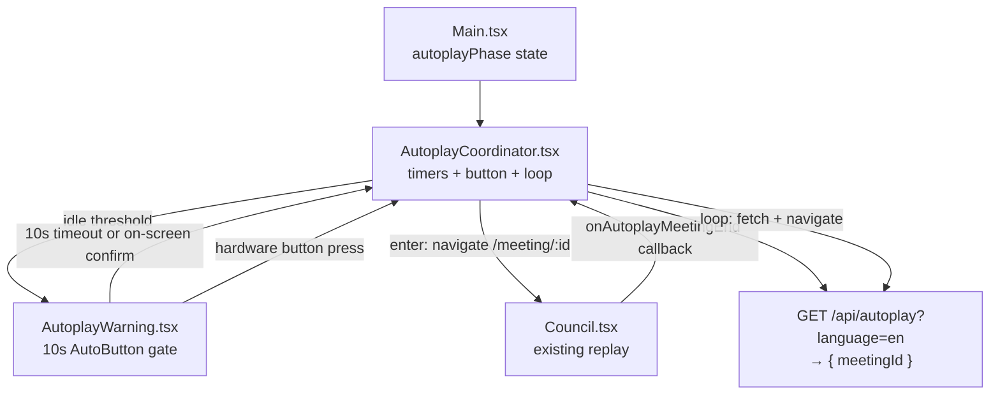

# Autoplay — Layer B implementation plan

This PR implements **Layer B only**: idle-triggered replay loops with no live AI cost. **Layer A** (auto-forward within a live meeting) is tracked separately in [`autoplay-layer-a-todo.md`](./autoplay-layer-a-todo.md).

---

## Goal

When the install is idle long enough, show a **10-second warning** so the visitor can stay; then tear down expensive realtime sessions and loop **completed meeting replays** (`GET /api/meetings/:id` without bearer — existing replay path). Pressing the hardware button during the warning grants more time; pressing it during autoplay exits to the normal start flow.

**Non-goals for this PR:** human-input skip timers, auto-wrap on `Completed`, name-overlay shortcuts, or any idle detection during live council playback.

---

## Architecture (minimal files)



### New / touched files (keep the surface small)

| File | Change |
|------|--------|
| `server/global-options.json` | Add `autoplayEarliestMeetingDate` (ISO string) |
| `server/src/logic/GlobalOptions.ts` | Schema field for the date |
| `server/src/api/meetingRoutes.ts` | Register `GET /api/autoplay` (+ handler inline or one small import) |
| `client/src/autoplay/AutoplayCoordinator.tsx` | Idle logic, loop, button claim, renders warning |
| `client/src/main/overlay/AutoplayWarning.tsx` | Pre-autoplay confirmation UI (`AutoButton`) |
| `client/src/main/Main.tsx` | `autoplayPhase` state; mount coordinator; pass props to `Council` |
| `client/src/council/Council.tsx` | Hide `ReplayModeBanner` when autoplay; fire end callback |
| `client/src/museum/button/buttonStore.ts` | Add `autoplay` owner; renumber priorities |
| `client/src/locales/translation_*.json` | Warning copy (en + sv) |
| `client/tests/...` | Coordinator + endpoint + warning tests |

No separate store, no `autoplayStore.ts`, no public config endpoint.

---

## State: one variable in `Main.tsx`

```ts
type AutoplayPhase = "off" | "warning" | "active";
const [autoplayPhase, setAutoplayPhase] = useState<AutoplayPhase>("off");
```

A small union is clearer than two booleans. It answers:

- **`off`** — normal interactive mode; idle timers running.
- **`warning`** — pre-autoplay overlay visible; visitor can bail out with the hardware button.
- **`active`** — coordinator is driving replay loop (vs a visitor who opened a replay URL manually).

Derived: `autoplayActive = autoplayPhase === "active"`.

Passed down as props — no zustand module.

`AutoplayCoordinator` receives `autoplayPhase`, `setAutoplayPhase`, plus `meetingliveKey` / `setMeetingliveKey` so it can clear live sessions before entering replay.

---

## `AutoplayCoordinator`

Single React component (`client/src/autoplay/AutoplayCoordinator.tsx`) owning all coordinator behaviour via `useEffect` + `useRef` (activity timestamp, loop-in-flight guard).

### Activation (museum mode only for now)

Gate with `isMuseumMode` inside the coordinator. The component name is mode-agnostic so activation rules can broaden later without renaming.

**Idle timers (hardcoded constants at top of file):**

| Context | Condition | Idle before enter |
|---------|-----------|-------------------|
| Setup entry (welcome `/` or abandoned `/new`) | `isInSetupEntryFlow` | ~90s |
| Summary (replay) | meeting route, no `liveKey`, summary overlay / playback done | ~60s |

**Explicitly no idle timer while:**

- Live council is playing (`meetingliveKey` set, council not on summary). Passive watchers may sit through the whole meeting; it ends at summary naturally, then the summary idle rule applies.
- Staff `#setup` overlay is open (`setup` button claim active — coordinator should not enter warning or autoplay).
- Already `autoplayPhase === "active"`.
- Warning already showing (`autoplayPhase === "warning"` — idle timer paused until warning resolves).

**Activity resets** the idle timer: hardware button down (while **not** in warning — see below), Space PTT, voice-guide caption/transcript (when setup shell is mounted), navigation.

### Pre-autoplay warning (`AutoplayWarning.tsx`)

Before `enterAutoplay()` runs, the coordinator shows a confirmation overlay. This gives a passive visitor (or someone still reading the summary) a chance to stay in the current flow.

**Location:** `client/src/main/overlay/AutoplayWarning.tsx` — same family as `CouncilError`, `ResetWarning`, etc. Rendered by `AutoplayCoordinator` inside the existing `Overlay` shell (not hash-routed via `MainOverlays`).

**Copy (i18n keys, e.g. `autoplayWarning.*`):**

> **Still there?**  
> This meeting has been inactive for a while, should we watch an old meeting instead?  
> Press the button if you need more time!

**UI:**

- Reuse `AutoButton` from `client/src/AutoButton.tsx` (same pattern as `CouncilError`): on-screen button label along the lines of “Watch an old meeting”.
- `timeout={10}` — after 10 seconds, `AutoButton` calls `onConfirm` → `enterAutoplay()`.
- Clicking the on-screen button also confirms immediately (same as error restart).

**Hardware button during warning:**

- Coordinator claims the button while `autoplayPhase === "warning"` (same `autoplay` owner / LED `pulse`).
- **Press within 10s → dismiss warning**, set `autoplayPhase` back to `"off"`, reset idle activity timestamp. Autoplay does **not** start.
- This matches the line “Press the button if you need more time!”

**When warning is skipped:**

- Only when transitioning from interactive idle → autoplay (setup entry flow or post-live summary).
- **Not** between meetings in the autoplay loop (`autoplayPhase === "active"`) — once confirmed, the next replay starts after the short post-summary idle without re-prompting.

**Flow:**

```
idle threshold reached
  → setAutoplayPhase("warning")
  → show AutoplayWarning overlay
  → hardware button press     → "off", reset idle timer
  → 10s timeout / UI confirm  → enterAutoplay()
```

### `enterAutoplay()`

1. `setAutoplayPhase("active")`
2. `setMeetingliveKey(null)` — drops socket / agents
3. `fetchAutoplayMeetingId(language?)` → `GET /api/autoplay`
4. `navigate(meetingPath(meetingId))` — existing `Council` load + replay manifest path

Unmounting the setup route stops the voice guide WebRTC session (no extra teardown API).

### Endless loop

Yes — **the coordinator owns the loop.**

1. `Council` calls `onAutoplayMeetingEnd()` when summary audio finishes (only when `autoplayActive`).
2. Coordinator waits `SUMMARY_END_IDLE_MS` (~30–45s, hardcoded).
3. Fetches next id from `GET /api/autoplay`, navigates to `/meeting/:newId`.
4. Repeat until button press or autoplay is exited.

Use a ref (`loopingRef`) to avoid double-fetch if effects re-fire. On fetch failure, retry after a backoff (hardcoded).

### Button press during autoplay

Inside coordinator when `autoplayPhase === "active"`:

- `claimButton("autoplay")`, LED `pulse`
- On press: `setAutoplayPhase("off")`, `useMeetingSetupStore.resetStore()`, hard navigate to `rootPath` (same pattern as `CouncilError` / meta-agent restart)

During `warning`, the same claim handles the dismiss path (see above).

### `buttonStore` priority

Renumber to avoid ties:

```ts
setup: 4
autoplay: 3
human-input: 2
voice-guide | meta-agent: 1
```

---

## Server: `GET /api/autoplay`

**Query:** `language` optional (e.g. `?language=en`). When omitted, sample from all languages.

**Response:** `{ meetingId: number }` only. Client uses existing `getMeeting({ meetingId })` without bearer — replay manifest + audio download unchanged.

**Selection query (conceptual):**

- `summary` exists and is non-null
- `date >= autoplayEarliestMeetingDate` from `global-options.json`
- optional `language` match
- has replayable content (apply same sanity checks as `buildReplayMeetingManifest` — if sample fails manifest build, retry `$sample` or return 404)

**Config in `global-options.json`:**

```json
"autoplayEarliestMeetingDate": "2025-06-01T00:00:00.000Z"
```

Hardcoded timing constants in `AutoplayCoordinator.tsx` / `AutoplayWarning.tsx`:

| Constant | Value | Where |
|----------|-------|-------|
| Setup-entry idle | ~90s | Coordinator |
| Summary idle (interactive) | ~60s | Coordinator |
| Warning countdown | 10s | `AutoplayWarning` (`AutoButton`) |
| Post-summary loop idle | ~30–45s | Coordinator (active phase only) |

No server config for timings.

---

## `Council.tsx` changes (small)

1. **Props:** `autoplayActive?: boolean`, `onAutoplayMeetingEnd?: () => void`
2. **Hide** `ReplayModeBanner` when `autoplayActive`
3. **End signal:** when `autoplayActive`, council state is `summary`, summary message has finished playing (`handleOnFinishedPlaying` path for the summary index), call `onAutoplayMeetingEnd()` once (guard with ref)

---

## Implementation order

1. Server: `autoplayEarliestMeetingDate` + `GET /api/autoplay` + tests
2. `buttonStore`: `autoplay` owner + priority renumber + test
3. `AutoplayWarning.tsx` + i18n strings
4. `AutoplayCoordinator` (idle → warning → enter) + wire in `Main.tsx`
5. `Council` end callback + banner hide
6. Manual install smoke test

---

## Test plan

**Automated**

- `GET /api/autoplay` returns only completed meetings after baseline date; respects optional `language`; 404 when pool empty
- `buttonStore`: `autoplay` wins over `voice-guide`, loses to `setup`
- Coordinator unit tests: idle opens warning (not active), activity resets, confirm enters active, loop calls API twice, button exits
- `AutoplayWarning`: `AutoButton` fires `onConfirm` at 10s; hardware dismiss callback not fired on confirm

**Manual (museum + PTT)**

1. Welcome screen (`/`), no input ~90s → warning overlay appears with countdown
2. Press hardware button on warning → overlay closes, stays on welcome screen, voice guide continues
3. Wait 10s on warning (or click confirm) → replay starts, no voice-guide WebRTC in network tab
4. Replay plays through → after summary idle, another meeting starts automatically (no second warning)
5. Button during replay → welcome screen, voice guide can start again
6. Start setup (`/new`), abandon ~90s → warning → autoplay
7. Live meeting playing → no warning mid-playback; after summary finishes + idle → warning → autoplay

---

## Related

- Layer A backlog: [`autoplay-layer-a-todo.md`](./autoplay-layer-a-todo.md)
- Museum chrome / button routing: [`museum-mode-plan.md`](./museum-mode-plan.md)
