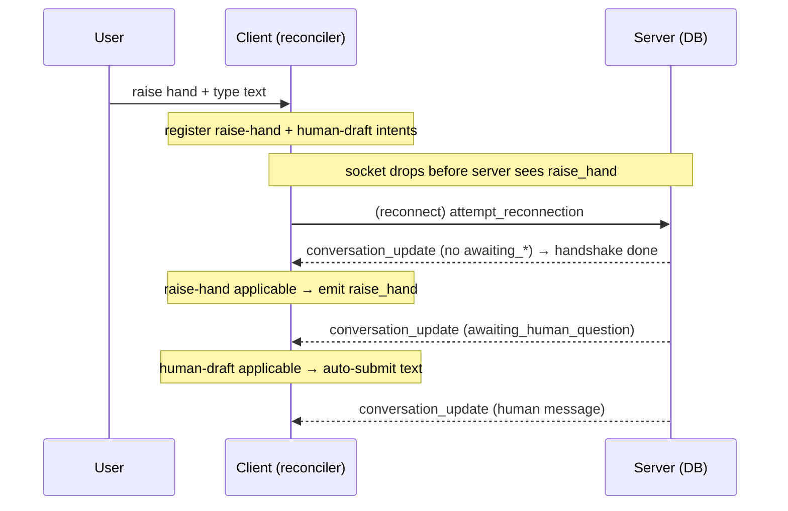

# Connection resilience & pending client intent — plan

How the live council survives socket drops without spurious error overlays, deadlocks,
lost user input, or crashes — and the client-side architecture that makes future
client-driven actions self-heal by default.

**Status:** All five PRs are implemented — PR 1 (deferred connection error), PR 2 (server graceful
stale-event handling), PR 3 (pending intent store + `raise_hand` reconciler), PR 4 (`human-draft`
intent, plus the invitation-skip Action A), and PR 5 (`resolve-extension` intent + the sendBuffer
clear). `skip_human_turn` remains the one Kind A event *not* routed through an intent — see PR 5's
notes for why that's an accepted, documented trade-off rather than an oversight.

**Related docs:** [agent-error-handling-plan.md](./agent-error-handling-plan.md),
[museum-kiosk-resilience-plan.md](./museum-kiosk-resilience-plan.md).

---

## Problem

When the socket connection drops (network blip, server redeploy), the client used to go
straight into the connection-error overlay and pause. But two things are true that we can
exploit:

1. There is often **buffered audio/text still to play**, so the meeting could keep going and
   the drop may resolve in the background before the user notices anything.
2. On reconnect the server **restores full meeting state from the DB** and re-broadcasts it, so
   the client can reconcile rather than error out.

The remaining hard problems are about **client-originated actions that are in flight when the
socket drops**. socket.io buffers `emit()` calls while disconnected and flushes them on
reconnect — *before* `attempt_reconnection` is processed — so the server drops them with
"No active session". That is safe for some events and broken for others.

---

## Core architecture

> **The DB is the source of truth for the conversation. The client is the source of truth for
> its own pending intent. On reconnect, the client re-asserts that intent after the resume
> handshake completes — it never relies on in-flight raw events surviving the disconnect.**

This is a **desired-state reconciler** (like a React render or a controller loop): desired state
= pending client intent; observed state = `councilState` + conversation; a reconciler applies the
intent whenever the observed state makes it valid.

The most important consequence:

> **There is no "on reconnect" code path. The reconciler is always running.** Reconnect is just
> one of several reasons the observed state changes; the reconciler responds to it the same way it
> responds to normal playback progress. On the happy path, intents fire immediately; on the
> reconnect path they wait until the state machine returns to the matching precondition.

This is the forget-proofing property: a future feature can't "forget" the reconnect race, because
there is no separate reconnect path to forget.

---

## Event taxonomy

Every client → server proxy event is one of:

- **Kind A — backed by a server-persisted sentinel.** The server wrote a "waiting" marker to the
  DB before the client acts; the event just says how to proceed. Self-heals on resume (server
  idles on the sentinel), today at the cost of a re-click / retype.
- **Kind B — pure client-originated intent, no server sentinel.** Intent exists only on the client
  until the event lands. Does **not** self-heal — this is the deadlock source.
- **Telemetry** — fire-and-forget, monotonic, self-heals by resend. Deliberately *not* an intent.

| Event | Kind | Intent? | Notes |
|-------|------|---------|-------|
| `raise_hand` | B | ✅ | The only true client-driven interrupt; the deadlock fix |
| `submit_human_message` / `submit_human_panelist` | A + client-only payload | ✅ | Preserves typed text |
| `extend_meeting` / `conclude_meeting` | A | ✅ | Removes the re-click after reconnect |
| `skip_human_turn` | A | ➖ optional | Same shape; low value |
| `report_maximum_played_index` | telemetry | ❌ | Monotonic resend; forcing it through the reconciler would only add noise |

`raise_hand` being the sole Kind B event is not a coincidence — it is the one place where intent
lives solely on the client and never received a durable server representation.

---

## Edge cases found

| # | Scenario at disconnect | Persisted last message | On reconnect | Verdict |
|---|------------------------|------------------------|--------------|---------|
| 1 | `extend_meeting` / `conclude_meeting` queued | `query_extension` | Server idles, re-broadcasts, client re-shows overlay | Self-heals (re-click) |
| 2 | `submit_human_*` / `skip_human_turn` queued | `awaiting_human_*` | Server idles, client re-shows input | Self-heals but **typed text lost** |
| 3 | `report_maximum_played_index` queued | any | Re-sent as playback continues | Harmless |
| 4 | **`raise_hand` queued** | plain message (no `awaiting_human_question` yet) | `attempt_reconnection` sends `handRaised: true` → server sets flag and **idles forever**; awaiting state never created | **Deadlock** |
| 5 | Any queued proxy event lands *after* the session is restored (timing flip) | e.g. `query_extension` already stripped | `handleExtendMeeting` throws → `reportAndCrashClient` | **Latent crash** |

Case 4 is the correctness bug. Case 5 is a latent fragility (correctness currently depends on
socket.io's buffer-vs-reconnect flush order). Case 2 is a UX/data-loss wart.

---

## The `pendingIntentStore` design

A dedicated zustand store (separate from `errorStore`, which owns error/connection *display*
state). The reconciler *reads* `errorStore`/socket health but intent is its own concern (it exists
even with a healthy socket — just consumed immediately).

Model intents as a **discriminated union** with an **exhaustive reconciler switch** (the compiler
forces you to handle timing for any new intent variant):

```ts
type PendingIntent =
  | { kind: "raise-hand"; meetingId: number; index: number; humanName: string }
  | { kind: "human-draft"; meetingId: number; text: string; mode: "question" | "panelist" }
  | { kind: "resolve-extension"; meetingId: number; choice: "extend" | "conclude" };

interface Observed {
  connected: boolean;
  attemptingReconnect: boolean;
  councilState: CouncilState;
  conversation: Message[];
  currentMeetingId: number;
}
```

**Global gate (applies to every intent):** `connected && !attemptingReconnect && intent.meetingId === observed.currentMeetingId`.

- `connected && !attemptingReconnect` is the safe version of "send `attempt_reconnection` first,
  then process the queue": the intent simply *sits in the store* until the resume handshake
  completes (we already flip `attemptingReconnect` false on the first post-reconnect
  `conversation_update`), then the reconciler fires it against fresh state. No raw replay, no
  ordering hacks.
- `meetingId` tagging means a stale intent can never apply to the wrong meeting.

**Per-intent policy** (the only thing a new feature author writes) = a precondition predicate +
an apply action:

| Intent | Precondition (beyond global gate) | Apply |
|--------|-----------------------------------|-------|
| `raise-hand` | conversation has no trailing `awaiting_*` / invitation | emit `raise_hand` (drives server toward `awaiting_*`) |
| `human-draft` | `councilState` is `human_input` / `human_panelist` | auto-submit the retained text |
| `resolve-extension` | `councilState` is `query_extension` | emit `extend_meeting` / `conclude_meeting` |

### Chaining (raise + type + disconnect)

The reconciler runs on every `(connected, attemptingReconnect, councilState, conversation)` change,
so intents chain automatically with no special-casing:



The **happy path uses the identical code**: register intent → precondition already met → fires
immediately. This lets us delete the ad-hoc `isRaisedHand` emit effect and any reconnect
special-case; they collapse into "register intent; reconciler emits when applicable".

---

## The invitation / playback-index rewind nuance  *(implemented)*

`handleOnSubmitHumanMessage` slices `textMessages` back past the **invitation** that precedes the
`awaiting_*` sentinel and rewinds `playingNowIndex`. On the server, `handleSubmitHumanMessage`
pops the `awaiting_*`, pops the invitation (`popInvitationIfPresent`), then pushes the human
message. So when a submit is lost to a disconnect, the resumed DB state still contains
`[…, invitation, awaiting_human_question]`, and a naive replay would replay the invitation audio.

Implemented as **two independent reconcile actions** (compatible with the store — decoupled,
precondition-driven):

- **Action A — skip invitation:** gate on **both** the invitation *and* its trailing `awaiting_*`
  being present, so it can never fire in the narrow "invitation arrived, sentinel hasn't" window
  and strand playback. (In practice the server broadcasts the whole conversation at once, so they
  arrive together; the precondition makes it robust regardless.) Implemented as an early check
  inside the main state-machine `useEffect` in `useCouncilMachine.ts` (right after the
  already-skipped check, before the `switch`/`loading` case), not as a separate effect — a separate
  effect running *after* the main one would risk the main effect's `'loading'` case dispatching the
  invitation's audio first (one-frame flash) before the skip got a chance to jump past it. The
  check: a `human-draft` intent is pending, `playNextIndex + 1 === intent.index`,
  `textMessages[playNextIndex]` is an `invitation`, and `textMessages[intent.index]` is the
  matching `awaiting_*` type — only then does it jump `playNextIndex` straight to `intent.index`
  (marking the invitation "passed" via `playingNowIndex` without ever calling
  `tryToFindTextAndAudio`/dispatching its audio).
- **Action B — auto-submit:** fires independently once `councilState` is back at
  `human_input` / `human_panelist`. This is the backstop — even if A never fires and the
  invitation plays, B still heals the state. (This is the pre-existing `human-draft` reconciler
  case from PR 4.)

Worst case (Action A's precondition not met — e.g. invitation and sentinel arrive in separate
updates) is a redundant invitation playback, never a stuck state or a crash, since B is
independent and unconditional on A having fired.

---

## Store lifecycle & clearing

- **In-memory store ⇒ full client restart/reload clears it for free.** The "user restarts the
  whole client during a disconnect" scenario is already safe — zustand state does not survive a
  reload.
- **SPA navigation to a different meeting is the real risk.** Clear the store on **Council
  unmount** (primary). `Council` is keyed by pathname in `Main.tsx`, so unmount fires on meeting
  change.
- **Belt-and-suspenders:** tag each intent with `meetingId`; the reconciler ignores intents whose
  `meetingId` ≠ current meeting. A stale intent can then never apply even if clearing is missed.
- **Per-intent pruning (optional):** drop an intent whose precondition can never be met again
  (meeting concluded, navigated away). Not required for correctness — an intent that never matches
  just sits harmlessly — but keeps the store honest.

---

## Invariants & backstops

- **Clear on observed fulfillment, not at emit time.** The reconciler clears an intent once the
  *server's* state confirms it landed (e.g. the `awaiting_*` sentinel appears), never right before
  the `emit()` call that requests it. This was a real bug caught during PR 3 review: clearing
  before emit means a request lost between `emit()` and ack (e.g. a disconnect in that instant)
  has no durable intent left to retry, so recovery quietly falls back to relying on socket.io's
  `sendBuffer` replay of the raw event — exactly the "raw event survives the disconnect" behavior
  the whole architecture exists to avoid (see "Core architecture" above). Clearing on fulfillment
  instead means the intent survives an in-flight loss and the next reconcile pass (post-reconnect
  or otherwise) simply re-emits it — the server-side idempotency in PR 2 (log-and-ignore /
  re-derive on duplicate) is what makes a possible duplicate emit safe.
  - This is *also* what makes "clear the socket `sendBuffer` on disconnect" (PR 3 below) safe to
    do at all: if intents were cleared at emit time, dropping the sendBuffer would mean a lost
    emit is unrecoverable (deadlock again). With fulfillment-based clearing, the durable intent is
    a strictly better source of truth than the sendBuffer, so the sendBuffer clear can land
    without reintroducing the risk it's meant to remove.
- **Idempotency backstop:** because clearing waits for fulfillment, the reconciler may emit the
  same request more than once (e.g. once, then again after a reconnect, if the first was lost in
  flight — or, in a narrower window, if it wasn't actually lost and the ack just hadn't arrived
  yet). The server absorbing a duplicate/re-derived request harmlessly (PR 2) is required, not
  optional, for this to be safe.
- **Human control wins:** lowering the hand or clearing the text removes the corresponding intent.
- **Server remains the backstop:** server handlers already validate state (`awaiting_*` /
  `query_extension` mismatch). The client preconditions mirror those guards so we never emit
  something the server will reject; the server guard stays as the last line of defense (see PR 2 —
  it should *reject gracefully*, not crash).

---

## PR breakdown

Each PR compiles, tests, and delivers value on its own.

```
PR1 (done) ─┐
PR2 (done, server) ─ independent, can land first
PR3 (done: store + raise_hand) ──┬── PR4 (done: human draft)
                                 └── PR5 (done: extend/conclude + sendBuffer clear)
```

### PR 1 — Deferred connection-error overlay  *(done)*
Council plays through buffered audio while the socket is unhealthy; the overlay only appears when
the machine is actually stuck (`loading` with nothing buffered) and clears immediately on
reconnect. Internal `socketUnhealthy` state + a deferred effect that sets
`setConnectionError("socket", blocked)` only when blocked.
- Files: `client/src/council/hooks/useCouncilMachine.ts`, tests in `useCouncilMachine.test.tsx`.
- No dependencies. Foundation.

### PR 2 — Server: graceful handling of stale / late proxy events  *(done)*
Replace `reportAndCrashClient` for "action arrived without its expected sentinel" (e.g.
`extend_meeting` with no `query_extension`, `submit_*` with no `awaiting_*`) with log-and-ignore.
- Value: server stops crashing clients on benign duplicate/racey events; closes case 5
  **regardless of client changes**; makes buffer-flush ordering irrelevant. This is also what
  makes fulfillment-based intent clearing (see "Invariants & backstops") safe — a duplicate/
  re-derived request from a retried intent is absorbed harmlessly instead of crashing.
- Files: `server/src/logic/MeetingLifecycleHandler.ts`, `server/src/logic/HumanInputHandler.ts`
  (+ reconnect tests).
- No dependencies; can land first.

### PR 3 — Client: `pendingIntentStore` + reconciler, with `raise_hand` as first consumer  *(done)*
New store + single reconciler effect in `useCouncilMachine`, gated on
`connected && !attemptingReconnect`. Route raise-hand through it; delete the ad-hoc raise-hand
emit and the reconnect special-case.
- Value: **fixes the raise-hand deadlock** and establishes the architecture, exercised by a real
  consumer.
- Files: new `client/src/.../pendingIntentStore.ts`, `useCouncilMachine.ts`, tests.
- Keystone PR.
- **Clearing fixed to be fulfillment-based** (clear when the `awaiting_*` sentinel is observed,
  not right before the `emit()`) — see "Invariants & backstops" for why clear-before-emit was a
  latent bug (it made recovery from an in-flight loss depend on the socket.io `sendBuffer`, which
  the architecture is designed specifically not to rely on).
- **Sendbuffer clear deferred to PR 5.** The plan originally called for clearing the socket
  `sendBuffer` on disconnect here, in `useCouncilSocket.ts`. Deferred because today
  `extend_meeting` / `conclude_meeting` are *not yet* intent-backed — the sendBuffer replay is
  currently their only recovery path, so clearing it now would regress them before PR 5 gives
  them an intent-based replacement. It's also only safe to do at all now that clearing is
  fulfillment-based (see above); do it once every intent-bearing event routes through the
  reconciler, so raw events never need to replay.

### PR 4 — Client: route human draft through pendingIntent (preserve typed text)  *(done)*
Adds `HumanDraftIntent` (`pendingIntentStore.ts`) and a `human-draft` reconciler case in
`useCouncilMachine.ts`. Implemented as a **belt-and-suspenders backstop**, not a replacement for the
existing submit path: `handleOnSubmitHumanMessage` still applies the submit immediately and
unconditionally (unchanged happy-path behavior, same as before this PR), but now *also* registers a
`human-draft` intent first, capturing `{ text, mode, index, speaker }` where `index` is the
conversation position of the `awaiting_*` sentinel being answered (captured **before** the local
optimistic truncation removes it — mirrors `raise-hand`'s own `index` field).
- **Fulfillment check, and why it's keyed on `index` rather than "awaiting absent at array end"**:
  the reconciler treats the intent as fulfilled once `textMessages[intent.index]` is no longer the
  expected `awaiting_*` type. In the happy path this becomes true on the very next reconcile pass —
  the submit's own local truncation already removed it — so the intent clears immediately without
  ever emitting again (verified by a "no double-submit" test). In the self-heal path (submit lost
  to a disconnect), the reconciler's global gate (`attemptingReconnect`/`socketUnhealthy`) prevents
  any pass from running until the resume handshake genuinely completes; when it does, the server's
  authoritative `conversation_update` — since the server never actually received the submit — still
  shows the *same* `awaiting_*` sentinel at that index, so the check reads "still awaiting" and the
  reconciler auto-resubmits the retained text via a shared `performHumanSubmit` helper (used by both
  the direct path and this retry, so a resubmit behaves identically to the first attempt).
- **Precondition to actually fire the retry** is `councilState === human_input` / `human_panelist`
  (per the per-intent policy table above), checked *after* the index-based fulfillment check so that
  a match on both doesn't get short-circuited by councilState still catching up (e.g. mid invitation
  replay) — the intent just waits, unfulfilled-but-not-yet-fireable, until councilState arrives.
- **Invitation-skip (Action A) added later**, alongside Action B — see "The invitation /
  playback-index rewind nuance" above.
- Files: `client/src/council/hooks/pendingIntentStore.ts`, `useCouncilMachine.ts`, tests in
  `useCouncilMachine.test.tsx` (`describe('human-draft intent reconciler')`).
- Value: typed text is never lost across a reconnect; completes the raise→type→disconnect chain.
- Depends on PR 3.

### PR 5 — Client: route `query_extension` resolution (extend/conclude) through pendingIntent  *(done)*
Adds `ResolveExtensionIntent` (`pendingIntentStore.ts`) and a `resolve-extension` reconciler case,
following the exact same shape as PR 4's `human-draft`: `handleOnExtendMeeting`/
`handleOnConcludeMeeting` register the intent (capturing `{ choice, index, date? }`, where `date` —
for conclude — is the browser-local date captured **at decision time**, so a retry after a
reconnect resolves with the *originally* intended date, not one re-derived at retry time) and then
apply it immediately via a shared `performResolveExtension` helper, unchanged happy-path behavior.
- **Real bug caught while writing the retry test, now fixed**: the local truncation that drops the
  `query_extension` sentinel from `textMessages` was originally *only* in the direct handlers, not
  in `performResolveExtension`. That's fine for the first attempt, but the reconciler's retry path
  calls `performResolveExtension` directly — without the truncation, a retry would re-emit and reset
  `councilState` to `'loading'` while the sentinel was still there, so the main effect immediately
  flipped back to `'query_extension'`, re-triggering the reconciler, forever. Fixed by moving the
  truncation into `performResolveExtension` itself (computed fresh from current `textMessages` on
  every call), mirroring how `performHumanSubmit` already owns its own truncation for PR 4. This is
  a useful general lesson for future intents built on this pattern: **the shared apply helper must
  be fully self-contained** (re-derive everything it needs from current state) since it's called
  from two different moments (direct action, reconciler retry) that can't assume the same
  pre-conditions were just established by the caller.
- **`skip_human_turn` intentionally left un-intent-backed.** The plan marked it "optional, low
  value" from the start. Clearing the socket `sendBuffer` (below) means a `skip_human_turn` lost to
  a disconnect will now simply self-heal by re-showing the input (case 2's existing behavior) rather
  than being silently replayed — the user just clicks skip again. Accepted trade-off, not a bug;
  revisit if it proves annoying in practice.
- UX note: the overlay may briefly re-show before the intent resolves; no transient affordance was
  added for this yet — worth revisiting if it looks jarring in practice.
- **Sendbuffer clear landed** in `useCouncilSocket.ts`'s `disconnect` handler
  (`socket.sendBuffer.length = 0`), now that every intent-bearing event (`raise_hand`,
  `submit_human_*`, `extend_meeting`/`conclude_meeting`) routes through the reconciler and no longer
  needs a raw replay to recover from a lost emit.
- Files: `client/src/council/hooks/pendingIntentStore.ts`, `useCouncilMachine.ts`,
  `useCouncilSocket.ts`, tests in `useCouncilMachine.test.tsx`
  (`describe('resolve-extension intent reconciler')`).
- Depends on PR 3.

---

## Testing notes

- Server: reconnect with `handRaised: true` and no awaiting sentinel re-establishes awaiting state
  (or is handled gracefully); buffered proxy event does not crash after resume.
- Client (`useCouncilMachine.test.tsx`): raise-hand-then-reconnect chains to auto-submit; draft
  survives reconnect; extend/conclude auto-resolves after reconnect; happy path unchanged;
  connection-unhealthy holds intents until handshake completes; intents tagged for a different
  `meetingId` never apply.
