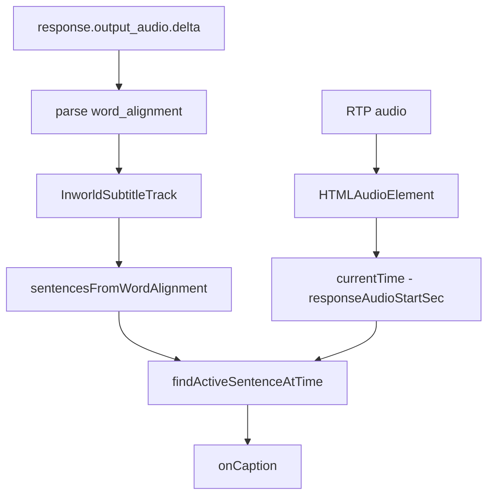

# Inworld-only realtime subtitles — fresh implementation plan

**Audience:** A new agent starting on branch `inworld-subtitles-fresh` from `main`, with **none** of the experimental word-timing work from `foods-leo`.

**Goal:** Sentence-by-sentence museum-guide subtitles driven **only** by Inworld `WORD` alignment over WebRTC. No CPS heuristic, no schedule stretching, no hybrid fallbacks. If alignment is missing or incomplete, show nothing (or hold the last valid caption) — do not invent timing.

**Status:** Plan only. Implementation not started on this branch.

---

## Executive answer: is the Inworld data enough?

**Yes, for this use case — if we use it the way Inworld documents it.**

Inworld explicitly targets **karaoke-style captions** and **word highlighting** via:

- `providerData.tts.timestamp_type: "WORD"`
- `providerData.tts.timestamp_transport_strategy: "SYNC"` (or `ASYNC`)
- `response.output_audio.delta` → `timestamp_info.word_alignment`

Per [Inworld provider data](https://docs.inworld.ai/realtime/provider-data#output-shape-—-response-output_audio-delta):

| Field | Meaning |
|-------|---------|
| `words[]` | Every token (words, punctuation, whitespace) **in spoken order** |
| `word_start_time_seconds[]` | Start of each token, **seconds from the beginning of the synthesized stream** |
| `word_end_time_seconds[]` | End of each token |
| `phonetic_details[].is_partial` | `true` while a word may still change; `false` when finalized |

Times are **playback-relative within one synthesized stream** (`content_index`), not wall clock. That is exactly what sentence subtitles need — *provided*:

1. We treat `words[]` as the **source of truth** for both text and timing (not a separate transcript + fuzzy matcher).
2. We maintain alignment state with the **documented streaming semantics** (cumulative replace vs partial updates — see §Validation).
3. We drive display with the **actual audio playback clock** (`HTMLAudioElement.currentTime`), not `performance.now()` minus an anchor.

If subtitles are still wrong after those three, the bug is either our merge/clock logic or an Inworld WebRTC quirk — not missing data fields.

---

## What went wrong on `foods-leo` (do not repeat)

The abandoned branch layered fixes on a wrong model:

| Mistake | Why it failed |
|---------|----------------|
| `splitSentences(transcript)` + `mapSentencesToWords()` | Transcript arrives early and can diverge from spoken tokens; token matching breaks on partial SYNC windows. |
| `mergeSyncChunkIntoSegment` with offset/rewind heuristics | Assumed sliding windows without confirming chunk semantics; corrupted timelines. |
| `scaleWordTimingsToTarget` (stretch to CPS heuristic) | Masked ~5s real alignment as ~15s; made logs look healthy. |
| `acceptWordMapping` prefix truncation | Silently dropped sentences 3–4 when validation failed. |
| `performance.now()` anchor + RAF | Playback ran 20s+ while schedule said 15s. |
| Heuristic fallback / `subtitle_heuristic=0` toggles | Hid whether word path worked. |

**This branch:** one path only — alignment → sentences → audio clock → caption.

---

## Relevant documentation (read first)

### Inworld (external)

| Topic | URL |
|-------|-----|
| TTS timestamps overview | https://docs.inworld.ai/tts/capabilities/timestamps |
| Streaming SYNC vs ASYNC | https://docs.inworld.ai/tts/capabilities/timestamps#streaming-behavior |
| Realtime `providerData.tts` | https://docs.inworld.ai/realtime/provider-data#tts-timestamps-and-alignment |
| `response.output_audio.delta` (WebRTC) | https://docs.inworld.ai/api-reference/realtimeAPI/realtime/realtime-webrtc#response-output_audio-delta |
| WebRTC audio (RTP track, empty `delta`) | https://docs.inworld.ai/realtime/connect/webrtc#audio |

### This repo (on `main`)

| File | Role |
|------|------|
| [client/src/voice/captionScheduler.ts](../client/src/voice/captionScheduler.ts) | **Replace** heuristic timer scheduler for guide path; keep API if tests need it |
| [client/src/voice/realtimeEventLoop.ts](../client/src/voice/realtimeEventLoop.ts) | Wire alignment events |
| [client/src/realtime/useRealtimeVoiceSession.ts](../client/src/realtime/useRealtimeVoiceSession.ts) | Museum session; remote audio + captions |
| [client/src/voice/remoteAudioAnchor.ts](../client/src/voice/remoteAudioAnchor.ts) | Onset detection — use for *when* response starts; clock = `audio.currentTime` |
| [server/src/api/realtimeProviders.ts](../server/src/api/realtimeProviders.ts) | Bootstrap `providerData` — add timestamp flags |
| [shared/textUtils.ts](../shared/textUtils.ts) | On `main`: `splitSentences` only |
| [docs/voice-guide-subtitle-pacing-plan.md](./voice-guide-subtitle-pacing-plan.md) | Transcript-vs-audio skew background |
| [docs/realtime-word-timing-subtitles-plan.md](./realtime-word-timing-subtitles-plan.md) | **Deprecated** — read only for event cheat sheet |

### Observed runtime facts (debugging `foods-leo`, June 2026)

Validate on day one; do not assume:

1. Alignment **does** arrive when bootstrap sets `timestamp_type: "WORD"`.
2. **`is_partial: false` was never seen** on WebRTC — may need partial words or `ASYNC`.
3. **Single `content_index`** (often `1`) for whole multi-sentence turns.
4. **Chunk times sometimes restart near 0** mid-response — determine cumulative vs windowed before merge logic.
5. Transcript deltas are **untimed** and early — not for timing.
6. First response may **cancel with zero audio deltas** — reset on `response.created`.

---

## Target behavior (simple)

```
Inworld word_alignment.words + times
        ↓
  group tokens into sentences (punctuation in words[])
        ↓
  TimedSentence[] { text, start, end }
        ↓
  playbackSec = remoteAudio.currentTime - responseAudioStartSec
        ↓
  findActiveSentenceAtTime(sentences, playbackSec)
        ↓
  onCaption(activeSentence.text)
```

**Invariants:** `start`/`end` are seconds from first sample of this response on the WebRTC `<audio>` element. No second timing source.

---

## Implementation steps

### Step 0 — Validate raw Inworld chunks (blocking)

Before writing merge logic, log each `response.output_audio.delta`:

```ts
{
  content_index,
  wordCount: words.length,
  firstStart: words[0]?.start,
  lastEnd: words[words.length - 1]?.end,
  firstTokens: words.slice(0, 5).map((w) => w.word),
  lastTokens: words.slice(-3).map((w) => w.word),
  finalizedCount,
  partialCount,
}
```

| Observation | Merge rule |
|-------------|------------|
| Each delta is a **superset** of the previous (longer `words[]`, start ~0) | **Replace** previous alignment for that `content_index` |
| Each delta is a **fixed window** (unrelated prefix, times jump) | Stop and clarify with Inworld — do not ship offset heuristics |
| Multiple `content_index` values | Offset segment *n* by prior segments' `lastEnd` |

**Validated June 2026 (voice-guide English turn):**

- `content_index` is always `1` for a full multi-sentence turn — no multi-index offset needed.
- Deltas are **sequential windowed chunks** (not cumulative). Times within a chunk are stream-relative to the *sentence*, not the response.
- **Each TTS sentence is its own time-zero segment.** After the last chunk of a sentence, Inworld sends an empty `words: []` chunk. The next sentence's first chunk starts again at `s ≈ 0`.
- `phonetic_details` / `is_partial` are never present on WebRTC — ignore entirely.
- Leading silence token: first token in each segment is `{"w":"","s":0,"e":~0.1}` — a brief silent lead-in before the first audible word.

**Confirmed merge rule:**
1. Accumulate `words[]` across chunks into a per-sentence buffer.
2. An empty `words[]` chunk is the flush signal: build a `TimedSentence` from the buffer.
3. Offset each sentence by the previous sentence's `end` (sentences play back-to-back in the RTP stream).
4. `start` = `offset + buffer[0].s` (≈ offset, includes lead-in silence); `end` = `offset + buffer[last].e`.

If validation fails, **do not** add CPS/heuristic timing.

### Step 1 — Server bootstrap

```ts
providerData.tts: {
  timestamp_type: "WORD",
  timestamp_transport_strategy: "SYNC", // or ASYNC per Step 0
}
```

### Step 2 — Parse events

`realtimeEventLoop.ts`: on `response.output_audio.delta`, parse `word_alignment` → `{ contentIndex, words }`.

### Step 3 — `inworldSubtitleTrack.ts` (new, ~150 lines)

- `sentencesFromWordAlignment(words)` — group tokens at `.` `!` `?` etc.; **no** `mapSentencesToWords`.
- `applyAlignment(contentIndex, words)` — latest cumulative snapshot per index; offset multiple indices.
- `getSentences()` → `TimedSentence[]`

### Step 4 — Playback clock (required)

`playbackSec = audio.currentTime - responseAudioStartSec` (set at first audible sample). Not `performance.now()`.

### Step 5 — Lifecycle

| Event | Action |
|-------|--------|
| `response.created` | reset track, clear caption |
| `output_audio.delta` | apply alignment |
| cancel / barge-in | reset, clear |
| `response.done` | keep showing until audio passes last `end` |

### Step 6 — Tests (minimal)

| Test | File |
|------|------|
| `sentencesFromWordAlignment` groups punctuation | `client/tests/unit/voice/inworldSubtitleTrack.test.ts` |
| cumulative replace per `content_index` | same |
| two `content_index` segments offset correctly | same |
| realtimeEventLoop passes alignment | extend existing test file |
| bootstrap timestamp flags | `server/tests/realtimeProviders.test.ts` |

Add fixtures: `client/tests/fixtures/inworld-word-alignment-*.json` from a captured session.

### Step 7 — Manual test checklist

1. Museum guide, 4+ sentence welcome monologue.
2. `getSentences().length` matches spoken sentences.
3. Each sentence visible while heard — not all at once, not stuck on last line.
4. Barge-in clears immediately.
5. Try `ASYNC` if SYNC partials never stabilize.

---

## File change summary (vs `main`)

| Action | Path |
|--------|------|
| Add | `client/src/voice/inworldSubtitleTrack.ts` |
| Add | `client/tests/unit/voice/inworldSubtitleTrack.test.ts` |
| Add | `client/tests/fixtures/inworld-word-alignment-*.json` |
| Edit | `server/src/api/realtimeProviders.ts` |
| Edit | `client/src/voice/realtimeEventLoop.ts` |
| Edit | `client/src/realtime/useRealtimeVoiceSession.ts` |
| Do **not** copy | `foods-leo` captionScheduler refactor, scaling, `subtitleInstrumentation.ts` |

---

## Architecture



---

## If Step 0 fails

| Symptom | Next action |
|---------|-------------|
| No `timestamp_info` on deltas | Verify bootstrap + model supports WORD on realtime |
| Times never grow for long audio | Inworld ticket + try ASYNC |
| `words[]` ≠ spoken text | Log only; still no invented timing |
| Clock correct, sentences wrong | Fix grouping in `sentencesFromWordAlignment` only |

---

## Explicit non-goals

- CPS heuristic pacing, schedule stretching, hybrid fallbacks
- `subtitle_heuristic` debug flags from `foods-leo`
- Copying `foods-leo` merge/scaling code from `shared/textUtils.ts`

---

## Branch setup

```bash
git checkout inworld-subtitles-fresh   # tracks origin/main
```

Your `foods-leo` WIP is stashed as `foods-leo word-timing WIP` — do not apply on this branch.

```bash
git stash list   # to recover old work on foods-leo later
git checkout foods-leo && git stash pop   # when you want the old branch back
```

---

## Success criteria

1. Four spoken sentences → four caption transitions, synced to audio.
2. No heuristic code path for museum guide subtitles.
3. Step 0 merge rule documented in this file after validation.
