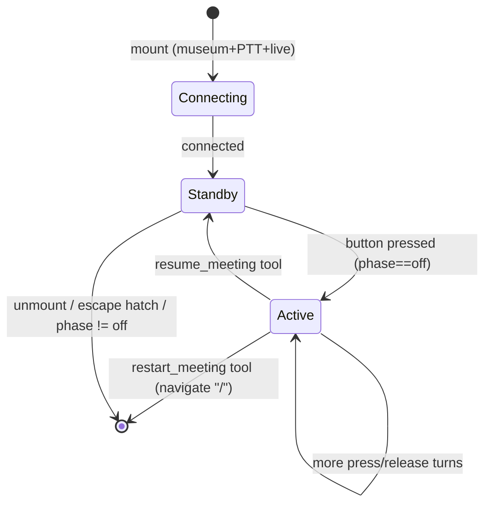

# Meeting Meta Agent — implementation plan

> **UI, captions, pause/freeze, and shared voice-session work** are planned in
> [meta-agent-realtime-ux-plan.md](./meta-agent-realtime-ux-plan.md) (phased
> implementation). This file keeps bootstrap, server, and early integration context.

A museum-only voice agent that runs **during a live council meeting**. The visitor
presses the hardware button at any time to pause the meeting and talk to the
"chair" (the meta agent). The agent can answer questions, resume the meeting, or
restart it. It hands the button over to `HumanInput` automatically when the
human-participation floor opens.

> Branch: **`foods-leo`** (upstream Council of Foods). Forest merges afterwards.
> Builds on the museum **button** refactor (`client/src/museum/button/*`), the
> voice-guide realtime pattern (`client/src/voice/*`), and the human-input
> pre-warm/PTT work (`client/src/council/humanInput/*`).

---

## Scope

**Active only when:** `isMuseumMode && getPushToTalk() && liveKey` (museum + PTT +
live meeting). Never in web mode, never in replay, never without the button.

In `Council` this is exactly the existing `isButtonMuseumMode` flag plus `liveKey`.

Out of scope for v1: always-on (non-PTT) mode, idle/return-to-landing,
auto-advancing overlays, a dedicated meta-agent voice/model on the server, and
cleaning up the voice guide's `micGainGate`.

---

## Decisions (locked)

| Topic | Decision |
|-------|----------|
| Mount point | `Council.tsx`, sibling to `HumanInput`, renders `null` |
| Gate | `isButtonMuseumMode && liveKey` |
| Connection | Its **own** WebRTC session (separate from HumanInput + voice guide) |
| Mic gating | **`track.enabled = false/true`** (not `micGainGate`) |
| Button signal | Gated **`pressed`** via `useButton(owner).pressed`, not `rawPressed` |
| LED owner | Add **`"meta-agent"`** to `ButtonLedOwner`, priority `1` |
| Button routing | Meta agent only reacts when `participationPhase === "off"` |
| Resume policy | Meeting resumes **only** via the `resume_meeting` tool (no auto-resume) |
| Chair id | `participants[0].id` (no `globalClientOptions`/global-options change) |
| Chair scene | Set `currentSpeakerId = chair` + force scene zoom while active |
| `metaAgentActive` | An **input to the existing speaker `useMemo`**, not a guard effect |
| State to agent | One **snapshot** on activate via `sendUserMessage` (not a tool) |
| Greeting | None — agent is silent until the visitor speaks |

---

## Why these match the current code

- The old `pttOwnership` LIFO stack is gone. Button routing lives in
  `client/src/museum/button/` (`buttonStore.ts`, `buttonIntent.ts`, `useButton`).
  Consumers use `useButton(owner)` with separate `claim()` / `setLed()` / `release()`.
  Meta-agent claims for the full meeting; human-input claims when `phase === "active"`;
  priority picks `buttonOwner`. See [meta-agent-realtime-ux-plan.md § Button routing](./meta-agent-realtime-ux-plan.md#button-routing-ptt-claim-model).
- `voice-guide` and `meta-agent` never run at the same time (voice guide lives in
  `MeetingSetupShell` and unmounts when the meeting starts). They could share a
  single `"agent"` owner, but we keep `"meta-agent"` separate for now and rename
  later.
- HumanInput needs `rawPressed` only for its connecting→ready race during the warm
  pre-warm window. The meta agent is connected and in standby (LED `pulse`) long
  before anyone presses, so gated `pressed` is correct and simpler.
- Foods derives the speaker in one `useMemo` (`derivedCurrentSpeakerId`) and
  publishes it with one effect. Folding `metaAgentActive` into that memo is the
  minimal, single-source-of-truth change.

---

## Component / file layout

```
client/src/museum/metaAgent/
  MeetingMetaAgent.tsx     # orchestration: standby/active, button, LED, snapshot; renders null
  useMetaAgent.ts          # WebRTC glue over the shared realtime primitives; exposes setMicEnabled
  metaAgentTools.ts        # tool schemas + handlers (restart, resume, continue/wrap placeholders)
  metaAgentPrompt.ts       # system prompt builder + buildMetaAgentStateSnapshot()
```

Mirrors the voice-guide split (`useVoiceGuide` / `MeetingVoiceGuide` /
`guideTools` / `guidePrompt`) but lighter. `metaAgentPrompt.ts` holds both the
prompt and the activate-snapshot text (both are just agent-facing strings).

### Modified files

| File | Change |
|------|--------|
| `client/src/museum/button/ledIntent.ts` | Add `"meta-agent"` owner, priority `1` |
| `client/tests/unit/museum/button/ledIntent.test.ts` | meta-agent vs human-input/setup cases |
| `client/src/council/Council.tsx` | Mount meta agent; add `metaAgentActive` state; feed it into `derivedCurrentSpeakerId`; pass to scene |
| `client/src/council/FoodsCouncilScene.tsx` | Accept `forceChairZoom` (or `metaAgentActive`) → `zoomIn = true` |
| `shared/RealtimeSessionTypes.ts` | Add `feature: "meta-agent"` request/call types |
| `server/src/api/realtimeSession.ts` | Accept `meta-agent` on bootstrap + call (bearer = liveKey) |
| `server/src/api/realtimeProviders.ts` | `getMetaAgentRealtimeBootstrap(language)` |
| `client/src/api/realtimeSession.ts` | `bootstrapMetaAgentRealtimeSession(...)` (+ call) |

### Reused as-is (no edits)

`client/src/realtime/realtimeConnection.ts` (`createRealtimeConnection`,
`fetchRealtimeBootstrap`), `client/src/voice/realtimeEventLoop.ts`
(`createEventLoop`), `client/src/realtime/realtimeProtocol.ts`
(`mergeRealtimeSessionWithClientConfig`). The meta agent does **not** need a new
`onResponseDone` callback because resume is tool-driven.

---

## State machine



| Mode | Playback | Mic `track.enabled` | LED (owner=meta-agent) |
|------|----------|---------------------|------------------------|
| connecting | playing | false | off |
| **standby** | playing | false | `pulse` |
| **active**, button up | **paused** | false | `pulse` |
| **active**, button down | **paused** | true | `on` |

Transitions:

- **standby → active** (first press): `setPaused(true)` → `setMetaAgentActive(true)`
  → `setMicEnabled(true)` → `sendUserMessage(buildMetaAgentStateSnapshot(...))`.
- **release (stay active):** `setMicEnabled(false)`. Meeting stays paused; the
  visitor can press again for another turn.
- **`resume_meeting`:** `setMicEnabled(false)` → `setPaused(false)` →
  `setMetaAgentActive(false)`. Back to standby.
- **`restart_meeting`:** navigate to `/` (`rootPath`); unmount tears down WebRTC.

---

## Button + LED wiring (in `MeetingMetaAgent`)

Meta-agent **always claims** while mounted. Human-input wins via priority when its
floor is `active`. No session teardown when ownership is lost (e.g. setup overlay).

```ts
const { claim, release, setLed, pressed } = useButton("meta-agent");

useEffect(() => {
  claim();
  return () => release();
}, [claim, release]);

useEffect(() => {
  setLed(ledMode);
}, [setLed, ledMode]);
```

`participationPhase` is passed only for the activate **state snapshot**, not for
button gating.

Press handling (effect on `pressed`):

- `pressed` rising in **standby** → enter **active** (pause + zoom + mic + snapshot).
- `pressed` rising in **active** → `setMicEnabled(true)` (next turn).
- `pressed` falling in **active** → `setMicEnabled(false)`.

---

## Chair zoom (foods)

The chair is `participants[0]` (first character; e.g. Water). Two changes:

1. **Center the chair** — in `Council.derivedCurrentSpeakerId`, branch first:

   ```ts
   const derivedCurrentSpeakerId = useMemo(() => {
     if (metaAgentActive) return participants[0]?.id ?? "";
     // ...existing logic
   }, [metaAgentActive, participants, councilState, playingNowIndex, textMessages, playNextIndex, humanName]);
   ```

   This answers the design question: `metaAgentActive` is just another input to the
   existing memo — no extra guard `useEffect`.

2. **Force the close-up** — `FoodsCouncilScene.zoomIn` is otherwise derived from
   `councilState`/snippet cadence, which won't trigger while paused. Pass
   `metaAgentActive` (as `forceChairZoom`) and short-circuit:

   ```ts
   const zoomIn = useMemo(() => {
     if (forceChairZoom) return true;
     // ...existing logic
   }, [forceChairZoom, /* existing deps */]);
   ```

On `resume_meeting`, `metaAgentActive` flips false, the memo recomputes, and normal
playback zoom/speaker behavior returns. (Forest, when merged, sets
`currentSpeakerId = ""` to zoom out to River — same `metaAgentActive` input,
different scene mapping. Not part of this PR.)

---

## `useMetaAgent` hook

Thin orchestration over the shared realtime primitives (same pattern as
`useVoiceGuide`, minus muting/captions/language-restart/hold-hint):

- On mount: `fetchRealtimeBootstrap({ feature: "meta-agent", language }, ...,)` with
  the live-key bearer + `getUserMedia` (in parallel), then
  `createRealtimeConnection(...)`. StrictMode-safe via an attempt counter +
  `AbortController` (copy the guard shape from `useVoiceGuide`).
- After connect: **disable mic tracks** (`micStream.getAudioTracks().forEach(t => t.enabled = false)`).
- `onOpen`: `loop.configureSession(buildSessionConfig(), { triggerGreetingOnReady: false })`.
- `createEventLoop` with handlers for captions (for the remote `<audio>` only),
  errors, and tool dispatch (`getCtx → toolHandlers`).
- Exposes: `connectionState` (`"idle" | "connecting" | "ready" | "error"`),
  `setMicEnabled(open: boolean)` (toggles `track.enabled`),
  `sendUserMessage(text)`, and `error`.
- On unmount: close connection, stop tracks. Button claim is released in effect cleanup.

No `micGainGate`. No remote-audio caption UI beyond a hidden autoplay `<audio>` for
the agent's voice.

---

## Tools (`metaAgentTools.ts`)

Same `RealtimeTool` / `ToolHandler` / `ToolResult` shapes as `guideTools.ts`.

| Tool | v1 | Handler |
|------|----|---------|
| `resume_meeting` | implement | `setMicEnabled(false)`; `setPaused(false)`; `setMetaAgentActive(false)` → `{ ok: true }` |
| `restart_meeting` | implement | navigate to `rootPath` (`/`) → `{ ok: true }` |
| `continue_meeting` | placeholder | `{ ok: false, error: "Not available yet" }` |
| `wrap_up_meeting` | placeholder | `{ ok: false, error: "Not available yet" }` |

`explain_whats_happening` is prompt-only (the agent uses the activate snapshot).
No `pause_meeting` (pause is implicit on press), `dismiss_overlay`,
`resume_incomplete_meeting`, or `raise_hand` in museum.

---

## Prompt + state snapshot (`metaAgentPrompt.ts`)

- **System prompt:** short (avoid Inworld `server_error` from long instructions).
  Role = the meeting's chair/host during a live museum council. Be concise; speak,
  don't reference on-screen UI. Hold the button to talk, release to send. If the
  council invites the visitor to speak, tell them they can press the button when
  prompted (the human floor takes over the button automatically). Use the synced
  state; never invent the topic or speakers. Call `resume_meeting` to continue or
  `restart_meeting` to start over.
- **Snapshot:** `buildMetaAgentStateSnapshot({ councilState, topicTitle,
  currentSpeakerName, humanName, participationPhase })` → a single
  `(STATE SYNC: {...})` line, mirroring `buildMeetingSetupSyncMessage`. Sent once
  when entering active mode.
- Locale: en + sv prompt/tool strings (small bundle, same approach as
  `voiceGuideBundle`). Provider pick mirrors voice guide (`sv → openai`, else
  `inworld`).

---

## Server

1. `shared/RealtimeSessionTypes.ts`: extend `RealtimeFeature` with `"meta-agent"`;
   add `MetaAgentRealtimeBootstrapRequest` / `MetaAgentRealtimeCallRequest`
   (same shape as the human-input variants — `feature`, `language`,
   `provider`/`sdp`/`session`).
2. `server/src/api/realtimeProviders.ts`: `getMetaAgentRealtimeBootstrap(language)`
   reusing `buildVoiceGuideRealtimeSessionFragment(language, provider)` (chair
   voice, semantic VAD, `create_response: true`). No new GlobalOptions.
3. `server/src/api/realtimeSession.ts`: accept `"meta-agent"` on both routes;
   require the live-key bearer + meeting existence (identical to `human-input`).
4. `client/src/api/realtimeSession.ts`: `bootstrapMetaAgentRealtimeSession(body,
   liveKey, signal)` and `createMetaAgentRealtimeCall(...)` (live-key auth headers).

---

## Tests

| Test | Covers |
|------|--------|
| `museum/button/ledIntent.test.ts` | `human-input`/`setup` beat `meta-agent`; meta-agent alone → its mode |
| `museum/metaAgent/metaAgentTools.test.ts` | `resume_meeting` flips paused/active; `restart_meeting` navigates; placeholders return error |
| `museum/metaAgent/metaAgentPrompt.test.ts` | snapshot JSON shape; null speaker/topic |
| `museum/metaAgent/MeetingMetaAgent.test.tsx` | no mount in web/replay/no-PTT; standby→active pauses + zooms; ignores press when `phase != "off"`; `resume_meeting` returns to standby |
| `api/realtimeSession.test.ts` (+ server integration) | `meta-agent` bootstrap requires bearer (401 without) |

Mock `useButtonStore` / button hooks the same way `HumanInput.test.jsx` does
(`mockUseButtonLed`, `setMockRawPressed` → here use the `pressed` selector). Mock
`createRealtimeConnection` and the bootstrap call.

---

## Build order

1. `ledIntent` — add `"meta-agent"` owner + test.
2. Server — types, `getMetaAgentRealtimeBootstrap`, route guards; client api fn + tests.
3. `metaAgentPrompt.ts` (prompt + snapshot) + `metaAgentTools.ts` + tests.
4. `useMetaAgent.ts` — WebRTC + `track.enabled` gating.
5. `MeetingMetaAgent.tsx` — standby/active, button/LED, snapshot, tool wiring.
6. `Council.tsx` — `metaAgentActive` state, mount, fold into speaker memo;
   `FoodsCouncilScene` forced zoom.
7. Component tests + manual pass.

---

## Manual test plan

1. Museum + PTT + live → LED pulses in standby. Web / replay / museum-without-PTT
   → no meta agent connection.
2. Press during playback → meeting pauses, scene zooms to the chair (Water),
   agent answers; **playback stays paused** after the agent finishes.
3. Multi-turn: press / speak / release repeatedly without resuming.
4. Say "continue / resume" → agent calls `resume_meeting` → playback resumes, zoom
   returns to normal.
5. Say "start over" → `restart_meeting` → lands on `/`.
6. Raise hand / panelist invite → `participationPhase` leaves `off` → `HumanInput`
   owns the LED + button; meta agent goes quiet. After submit/close → meta agent
   regains `pulse`.
7. Escape hatch museum → web mid-meeting → meta agent unmounts, button bridge
   disconnects.

---

## Changelog

| Date | Change |
|------|--------|
| 2026-06-22 | Initial plan: meta agent on `foods-leo`, `ledIntent` `"meta-agent"` owner, `track.enabled` gating, gated `pressed`, chair = `participants[0]`, `metaAgentActive` folded into speaker memo + forced scene zoom, tool-only resume, snapshot on activate |
