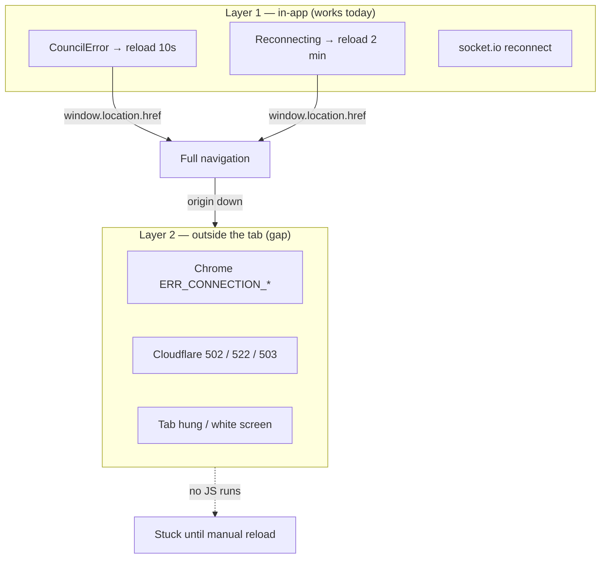

# Museum kiosk resilience — integration plan

Physical museum installs must recover from transient outages (deploys, network
blips) **and** from failure modes where the React app is not running at all
(Chrome error pages, Cloudflare 502/522, hung tabs).

**Status:** Planned.

**Related docs:** [agent-error-handling-plan.md](./agent-error-handling-plan.md),
[button/bridge/README.md](../button/bridge/README.md).

---

## Goals

1. **Runtime errors (app loaded)** — keep improving in-app recovery; avoid
   reloading into a dead origin during deploys.
2. **Navigation errors (app not loaded)** — host-level watchdog reloads the
   kiosk Chrome tab when the remote origin is unreachable or the tab is stuck.
3. **Deploy window** — shrink outage overlap via ops; document install checklist.
4. **Separate PRs** — each layer ships independently; museum installs can adopt
   host watchdog without waiting on client changes.

---

## Problem: two failure layers



| Layer | Examples | Current handling | Gap |
|-------|----------|------------------|-----|
| **In-app** | Socket drop, API 5xx, `conversation_error`, autoplay failure | `Reconnecting` (2 min), `CouncilError` (10 s), socket.io retry | Reload can fire while origin is down |
| **Outside tab** | Chrome “site can’t be reached”, CF error page, crashed renderer | None | Tab stays broken indefinitely |

A ~1 s deploy blip is usually fine **if no hard reload fires in that window**.
The dangerous overlap is: **Reconnecting/CouncilError timer elapses** while the
server is still down → `location.href` → browser/CDN error page → no timers run.

---

## Current in-app behavior (baseline)

| Path | Trigger | Museum action | File |
|------|---------|---------------|------|
| Connection loss | `connectionError` (socket, voice-guide, meta-agent) | `Reconnecting` overlay; hard reload after **2 min** | `Reconnecting.tsx` |
| Fatal error | `setUnrecoverableError` | `CouncilError` overlay; `AutoButton` reload after **10 s** | `CouncilError.tsx` |
| Socket retry | `connect_error` / reconnect | socket.io background retry | `useCouncilSocket.ts` |

Server health endpoint already exists: `GET /health` → `200` (`server/server.ts`).

---

## Target architecture (three layers)

```mermaid
flowchart LR
  subgraph Client["Client (browser)"]
    Probe[Probe-before-reload]
    RC2[Reconnecting / CouncilError]
    Boot[Optional index.html bootstrap]
  end

  subgraph Host["Kiosk Mac (launchd)"]
    WD[Kiosk watchdog process]
    BR[Button bridge — unchanged scope]
  end

  subgraph Remote["Deployed origin"]
    HC[/health]
    App[SPA + API + socket]
  end

  RC2 --> Probe
  Probe -->|only if healthy| App
  WD -->|poll| HC
  WD -->|reload tab if unhealthy N times| Client
  BR -->|USB + ws://127.0.0.1:8765| Client
```

| Layer | Responsibility | PR |
|-------|----------------|-----|
| **A — Client probe-before-reload** | Don’t navigate to `rootPath` until `/health` (or equivalent) succeeds; backoff retry | PR 1 |
| **B — Host kiosk watchdog** | Poll remote health; reload Chrome tab when origin down or tab unresponsive | PR 2–3 |
| **C — Ops / deploy** | Zero-downtime deploy notes; optional CF custom error page with meta-refresh | PR 4 |
| **D — Bootstrap watchdog (optional)** | Tiny `index.html` script: reload if React never mounts | PR 5 (low priority) |

---

## Where to start

**Recommended order:**

1. **This doc** (plan only) — align on PR split and watchdog placement.
2. **PR 1 — Client probe-before-reload** — small, client-only, immediately
   reduces “reload into dead server” during deploys. No install changes.
3. **PR 2 — Kiosk watchdog daemon** — new package + core logic (health poll,
   Chrome reload). Fixes the stuck-tab case.
4. **PR 3 — macOS install** — `launchd` plist, install script, museum README.
5. **PR 4 — Deploy / ops doc** — deploy checklist for staff; optional Cloudflare
   error-page auto-refresh.
6. **PR 5 (optional) — `index.html` bootstrap** — only if we still see
   white-screen / bundle-load failures in the field.

PR 1 is the fastest win. PR 2–3 is the real fix for Chrome/Cloudflare error
pages. Do **not** block PR 1 on the host watchdog.

---

## PR 1 — Client: probe-before-reload

**Detailed plan:** [museum-kiosk-resilience-pr1.md](./museum-kiosk-resilience-pr1.md)

**Goal:** Museum hard-reloads only when `GET /health` succeeds.

**UX (locked in):**

- **CouncilError** — keep 10 s `AutoButton` countdown; on fire → brief
  **checking** state (spinner + “Checking connection…”); reload if healthy, else
  **new 15 s countdown** (loop). No extra warning line.
- **Reconnecting** — after 2 min, switch subtitle to “Waiting for server…”;
  probe with backoff in background (spinner already visible; no second countdown).

### Exit criteria

- [ ] Museum `Reconnecting` never calls `location.href` while `/health` fails.
- [ ] Museum `CouncilError` same (health-aware button loop).
- [ ] Manual checklist in PR 1 doc completed.

---

## PR 2 — Kiosk watchdog daemon (logic + CLI)

**Goal:** Process on the museum Mac that polls the deployed app and reloads
Chrome when unhealthy.

### Recommended placement: **separate process** (not inside button bridge)

See [Watchdog: separate vs bridge](#watchdog-separate-process-vs-button-bridge)
below.

### Proposed location

```
museum/kiosk-watchdog/     # new top-level folder (sibling to button/, client/)
  package.json
  src/
    index.ts               # CLI entry
    healthPoll.ts
    chromeReload.ts        # AppleScript or chrome-cli
    config.ts
  tests/
```

Rationale: watchdog applies to **every** museum kiosk (with or without USB
button). Button bridge stays focused on serial + WebSocket.

### Behavior (v1)

| Setting | Default | Notes |
|---------|---------|-------|
| `KIOSK_HEALTH_URL` | `https://…/health` | Required |
| `KIOSK_APP_URL` | `https://…/` | Tab to reload |
| `KIOSK_POLL_INTERVAL_MS` | `30_000` | |
| `KIOSK_FAILURE_THRESHOLD` | `3` | Consecutive failures before reload |
| `KIOSK_CHROME_PROFILE` | optional | Kiosk Chrome user data dir / window title match |

Loop:

1. `GET` health URL (`cache: no-store`, timeout 10 s).
2. On failure → increment counter; on success → reset counter.
3. When counter ≥ threshold → reload Chrome tab showing `KIOSK_APP_URL`
   (AppleScript: find window/tab by URL prefix, `tell active tab to reload`;
   fallback: `open -a "Google Chrome" "$KIOSK_APP_URL"`).
4. Log to stdout (launchd captures).

Optional v1.1: detect “stuck on error page” by checking tab URL contains
`chrome-error://` or known CF error patterns (harder; may defer).

### Out of scope for PR 2

- `launchd` install scripts (PR 3).
- Bundling with button bridge release tarball.

### Tests

- Unit: failure counting, threshold triggers reload mock, success resets counter.
- Integration (CI): mock HTTP server + mock `chromeReload` function.

### Exit criteria

- [ ] `npm test` passes in `museum/kiosk-watchdog/`.
- [ ] Manual on dev Mac: point at staging URL, stop server, confirm reload
  after N failures.

---

## PR 3 — macOS install (launchd)

**Goal:** One-command install for field staff, mirroring button bridge patterns.

### Deliverables

- `museum/kiosk-watchdog/install/macos/com.council.kiosk-watchdog.plist`
- `install.sh` / `uninstall.sh` (local dev + release variants if needed)
- Env file template: `/etc/council/kiosk-watchdog.env` or plist `EnvironmentVariables`
- Log paths: `/var/log/council-kiosk-watchdog.log`
- Section in museum install README (or extend `button/README.md` with pointer)

### Install checklist (for doc)

1. Set `KIOSK_HEALTH_URL` and `KIOSK_APP_URL` for this install.
2. `sudo ./install.sh`
3. Chrome opened in kiosk/fullscreen to `KIOSK_APP_URL` (existing ops step).
4. Verify: `curl` health OK; stop remote server → watchdog reloads tab within
   ~threshold × poll interval.

### Exit criteria

- [ ] Survives reboot (`RunAtLoad` + `KeepAlive`).
- [ ] Independent of button bridge running or not.

---

## PR 4 — Deploy / ops hardening

**Goal:** Shrink the deploy outage window; document what staff should do.

### Scope (documentation + optional infra)

- **Deploy:** prefer rolling / blue-green so old instances serve until new
  passes `/health`; note in deploy README.
- **Cloudflare (optional):** custom 502/503 page with
  `<meta http-equiv="refresh" content="30">` and branded “reconnecting” copy.
  Helps CF-served errors only — not Chrome `ERR_*`.
- **Monitoring (optional):** external uptime ping + alert (UptimeRobot, etc.) —
  does not self-heal but reduces surprise.

### Exit criteria

- [ ] Deploy runbook updated.
- [ ] Museum install doc links watchdog + client probe behavior.

---

## PR 5 (optional) — `index.html` bootstrap watchdog

**Goal:** If the JS bundle fails to load (CDN glitch, bad deploy asset), reload
after a timeout.

### Scope

- Inline script in `client/index.html` before React bundle:
  - `setTimeout` ~120 s; if `!window.__COF_BOOTSTRAPPED__`, `location.reload()`.
- Set `window.__COF_BOOTSTRAPPED__ = true` in `client/src/index.tsx` on mount.

### Limitation

Does **not** run on Chrome/Cloudflare error pages (no HTML delivered). Host
watchdog (PR 2–3) remains required for that class.

---

## Watchdog: separate process vs button bridge

### Option A — Separate process (recommended)

| Pros | Cons |
|------|------|
| Works on **all** museum kiosks, including installs **without** a USB button | Another `launchd` service to install and document |
| Bridge crash / USB replug does **not** stop tab recovery | Slightly more field-setup steps |
| Clear separation of concerns: bridge = hardware; watchdog = display health | Two log files to check |
| Can reload Chrome without restarting serial port (avoids USB churn) | |
| Independent release cycle and versioning | |
| Watchdog can be added to existing installs without upgrading bridge | |

### Option B — Inside button bridge

| Pros | Cons |
|------|------|
| Single `launchd` unit, one installer, one release tarball | Couples unrelated subsystems |
| Museum Mac already runs bridge when using PTT button | **No recovery** on installs without button hardware |
| | Bridge restart (deploy, crash, `EADDRINUSE`) pauses watchdog |
| | Chrome reload logic in a USB daemon is harder to reason about and test |
| | Watchdog outages tied to bridge outages |

### Option C — Separate process, shared install script

Middle ground: **separate daemons**, one `install-museum-kiosk.sh` that installs
both bridge (if hardware present) and watchdog (always). Best ops ergonomics
without merging runtimes.

**Recommendation:** **Option A** for implementation; evolve to **Option C** for
field install UX once both exist.

---

## Watchdog vs in-app reload — who does what

| Scenario | In-app (PR 1) | Host watchdog (PR 2–3) |
|----------|---------------|-------------------------|
| Socket down, app visible | Reconnecting + probe-before-reload | Idle (health may still pass) |
| API down, `CouncilError` | Probe-before-reload | Idle until health fails |
| Reload during deploy outage | **Stays on overlay**, retries probe | Reloads tab when health returns |
| Chrome error page | Stuck — no JS | **Reloads tab** |
| Cloudflare 502 page | Stuck — no JS | **Reloads tab** (if health fails) |
| Tab hung, server OK | Stuck | Future: tab URL / heartbeat check |

Host watchdog is the **only** fix for navigation-level failures. Client probe
reduces how often we **cause** those failures.

---

## File map (planned)

| Path | PR | Role |
|------|-----|------|
| `docs/museum-kiosk-resilience-plan.md` | — | This plan |
| `docs/museum-kiosk-resilience-pr1.md` | 1 | Detailed PR 1 plan |
| `client/src/museum/kioskHealth.ts` | 1 | `probeOriginHealth` helper |
| `client/src/museum/MuseumHealthReloadButton.tsx` | 1 | Countdown → check → retry loop |
| `client/src/museum/useMuseumProbeReload.ts` | 1 | Hook for Reconnecting |
| `client/src/main/overlay/Reconnecting.tsx` | 1 | Backoff probe + subtitle |
| `client/src/main/overlay/CouncilError.tsx` | 1 | Health-aware button |
| `museum/kiosk-watchdog/` | 2 | Daemon package |
| `museum/kiosk-watchdog/install/macos/` | 3 | launchd + install scripts |
| `client/index.html` | 5 | Optional bootstrap script |

---

## Test plan (manual — museum install)

After PR 1 + PR 3 on a staging kiosk:

1. **Happy path** — app running; stop server 30 s; start server; in-app
   reconnect heals without stuck error page.
2. **Reconnecting timer** — force long outage > 2 min; confirm probe prevents
   blind reload; overlay stays until health OK.
3. **CouncilError** — trigger fatal error; confirm 10 s restart waits for health.
4. **Watchdog** — kill server; Chrome shows error page; confirm watchdog reloads
   within ~3 × poll interval after health returns.
5. **Deploy** — deploy staging during active session; confirm recovery without
   staff intervention.
6. **Bridge independence** — stop bridge; watchdog still runs; stop watchdog;
   bridge still runs.

---

## Open questions

1. **Chrome targeting** — one fullscreen window per machine (assumed), or
   multiple displays?
2. **Health URL** — same origin as app (`/health` on council domain) vs
   separate status endpoint?
3. **Threshold tuning** — 3 × 30 s = 90 s max stuck on error page; acceptable?
4. **Release packaging** — separate GitHub release tag `kiosk-watchdog-v*` mirroring
   button bridge, or monorepo npm workspace only for now?

---

## Changelog

| Date | Change |
|------|--------|
| 2026-07-05 | Initial plan: layer gap analysis, PR split, separate watchdog recommended |
