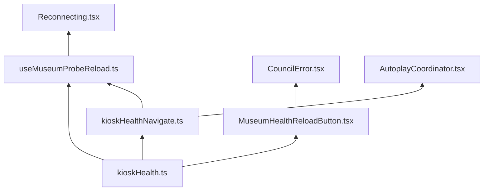
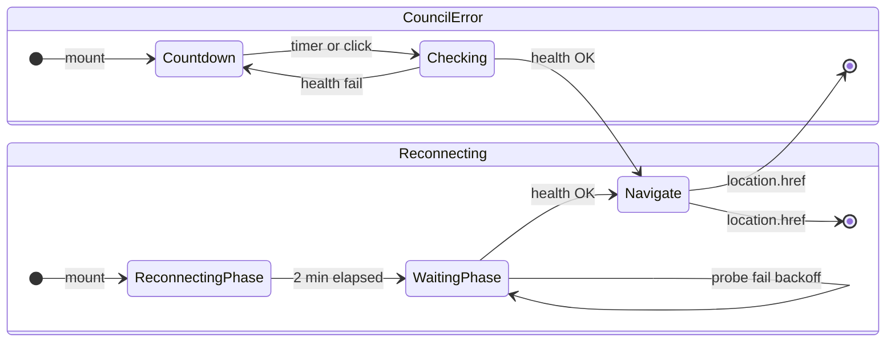

# Museum kiosk resilience — PR 1 plan

**Parent:** [museum-kiosk-resilience-plan.md](./museum-kiosk-resilience-plan.md)

**Goal:** Museum hard-reloads only when `GET /health` succeeds. Never blind
`window.location.href` into a deploy outage.

**Status:** Ready to implement.

---

## Build plan (file by file)

No new dependencies. Everything lives under existing `client/` patterns (`@/museum`,
`@main/overlay`, vitest unit tests). **Do not modify** `AutoButton.tsx` or
`server/server.ts` (health endpoint already exists).

### File tree (this PR only)

```
client/src/museum/
  kioskHealth.ts                    NEW — pure fetch + constants
  kioskHealthNavigate.ts            NEW — shared “probe then assign href” helper
  MuseumHealthReloadButton.tsx      NEW — CouncilError UI state machine
  useMuseumProbeReload.ts           NEW — Reconnecting timer + backoff loop

client/src/main/overlay/
  CouncilError.tsx                  EDIT — swap museum AutoButton for new component
  Reconnecting.tsx                  EDIT — hook + subtitle switch

client/src/autoplay/
  AutoplayCoordinator.tsx           EDIT — exitAutoplay uses navigate helper

client/src/locales/
  translation_en.json               EDIT — 2 new error strings

client/tests/unit/museum/
  kioskHealth.test.ts               NEW
  kioskHealthNavigate.test.ts       NEW
  MuseumHealthReloadButton.test.tsx NEW
  useMuseumProbeReload.test.ts      NEW

client/tests/unit/main/overlay/
  Reconnecting.test.tsx             EDIT — museum cases + fetch mock
  CouncilError.test.tsx             NEW — web vs museum wiring
```

### Layer 1 — Pure helpers (no React)

**`client/src/museum/kioskHealth.ts`**

Responsibility: everything that can be unit-tested without React.

| Export | Purpose |
|--------|---------|
| `HEALTH_PROBE_TIMEOUT_MS` | `5_000` |
| `RECONNECT_PROBE_BACKOFF_MS` | `[15_000, 30_000, 60_000]` |
| `MUSEUM_AUTO_RESTART_SECONDS` | `10` (move from `CouncilError`) |
| `MUSEUM_RETRY_RESTART_SECONDS` | `15` |
| `MUSEUM_RECONNECTING_RESTART_MS` | `2 * 60 * 1000` (move from `Reconnecting`) |
| `probeBackoffMs(attempt)` | Index into backoff table, cap at last entry |
| `probeOriginHealth(signal?)` | `fetch("/health", { cache: "no-store" })` → `true` iff status 200 |

Implementation notes:

- Combine caller `AbortSignal` with a timeout `AbortController` so probes never hang.
- Return `false` on network throw, non-200, abort — never throw to callers.
- No logging inside every poll; callers log phase transitions.

**`client/src/museum/kioskHealthNavigate.ts`**

Responsibility: one-liner used by hook + autoplay — “probe once, navigate if OK”.

| Export | Purpose |
|--------|---------|
| `navigateWhenHealthy(targetPath, signal?)` | `await probeOriginHealth` → if true, set `location.href` once, return `true` |

Why a second file: `AutoplayCoordinator` and tests can import navigate without
pulling in React. Keeps `kioskHealth.ts` fetch-only.

**Tests:** `kioskHealth.test.ts`, `kioskHealthNavigate.test.ts` — mock `global.fetch`,
fake timers not needed yet.

---

### Layer 2 — React pieces

**`client/src/museum/MuseumHealthReloadButton.tsx`**

Only used from `CouncilError.tsx` when `isMuseumMode`.

| State | Renders |
|-------|---------|
| `phase: "countdown"` | `<AutoButton key={cycle} timeout={…} action={onCountdownEnd}>` |
| `phase: "checking"` | `<button disabled>` + inline spinner + `error.checkingConnection` |

Internal refs:

- `navigatedRef` — prevent double `location.href`
- `abortRef` — abort probe on unmount

`onCountdownEnd` (sync, called by AutoButton):

1. Set `phase` → `"checking"`.
2. `void` async IIFE: `probeOriginHealth(signal)`.
3. Success → `location.href = targetPath`.
4. Fail → increment `cycle`, set `phase` → `"countdown"`, use
   `retryCountdownSeconds` when `cycle > 0`.

Spinner choice: **small inline element** in the button (not full-page `Loading` —
that component is absolutely positioned for overlay centers). Either a minimal CSS
border spinner or a tiny reused Lottie — prefer CSS to avoid layout jump.

**`client/src/museum/useMuseumProbeReload.ts`**

Only used from `Reconnecting.tsx`.

| Option | Value |
|--------|-------|
| `enabled` | `isMuseumMode` |
| `targetPath` | `rootPath` |
| `startAfterMs` | `MUSEUM_RECONNECTING_RESTART_MS` |

Returns `{ waitingForServer: boolean }` where `waitingForServer` is true after
`startAfterMs` has elapsed (drives subtitle). Implementation:

1. `useEffect`: if `!enabled`, return.
2. `setTimeout(startAfterMs)` → set `waitingForServer = true`, start probe loop.
3. Probe loop: `while (!aborted) { ok = await probeOriginHealth; if (ok) navigate; await sleep(probeBackoffMs(n++)) }`.
4. Cleanup: clear timeout, abort controller.

Does **not** render UI — `Reconnecting` reads `waitingForServer` for copy only.

**Tests:** `MuseumHealthReloadButton.test.tsx`, `useMuseumProbeReload.test.ts`.

---

### Layer 3 — Wire existing overlays

**`client/src/main/overlay/CouncilError.tsx`** (small edit)

| Before | After |
|--------|-------|
| `MUSEUM_AUTO_RESTART_SECONDS` local const | import from `kioskHealth.ts` |
| `restart` callback + `<AutoButton action={restart}>` | museum: `<MuseumHealthReloadButton targetPath={rootPath} />` |
| `<a href={rootPath}><button>` for web | unchanged |

Remove `useCallback` for `restart` if unused.

**`client/src/main/overlay/Reconnecting.tsx`** (small edit)

| Before | After |
|--------|-------|
| `MUSEUM_RECONNECTING_RESTART_MS` local const | import from `kioskHealth.ts` |
| `useEffect` → `setTimeout` → `location.href` | delete |
| subtitle always `error.reconnecting` | `waitingForServer ? error.waitingForServer : error.reconnecting` |
| — | `useMuseumProbeReload({ enabled: isMuseumMode, targetPath: rootPath, startAfterMs: … })` |

Spinner / heading unchanged — `Loading` + `error.connection` stay as-is.

**`client/src/autoplay/AutoplayCoordinator.tsx`** (small edit)

`exitAutoplay` today:

```ts
window.location.href = "/";
```

Change to:

```ts
if (isMuseumMode) {
  void navigateWhenHealthy("/");  // no UI — button press while staff exits autoplay
} else {
  window.location.href = "/";
}
```

If probe fails, visitor stays on current page (acceptable — staff action, server
likely up). Optional: loop with backoff — **out of scope** unless you want parity;
document as known limitation.

---

### Layer 4 — Copy

**`client/src/locales/translation_en.json`**

Under `"error"`:

- `checkingConnection`: `"Checking connection…"`
- `waitingForServer`: `"Waiting for server…"`

(Only `translation_en.json` exists in repo today.)

---

### What we explicitly do NOT touch

| File | Reason |
|------|--------|
| `AutoButton.tsx` | Sync action contract; museum logic stays in wrapper |
| `Main.tsx` | Overlays already compose `CouncilError` / `Reconnecting` |
| `errorStore.ts` | No new error types |
| `useCouncilSocket.ts` | Socket retry unchanged |
| `server/server.ts` | `/health` already returns 200 |

---

### Commit / review order (suggested)

Build and land in this sequence so each step is testable:

| Step | Files | Review focus |
|------|-------|----------------|
| **1** | `kioskHealth.ts` + `kioskHealthNavigate.ts` + tests | Fetch contract, timeout, backoff math |
| **2** | `MuseumHealthReloadButton.tsx` + test | Countdown → check → retry UX |
| **3** | `CouncilError.tsx` + `CouncilError.test.tsx` | Museum vs web split |
| **4** | `useMuseumProbeReload.ts` + test | 2 min gate, backoff, no blind href |
| **5** | `Reconnecting.tsx` + extend `Reconnecting.test.tsx` | Subtitle switch |
| **6** | `AutoplayCoordinator.tsx` | One-line navigate helper |
| **7** | `translation_en.json` | Copy |

Steps 1–3 can be one PR commit each or squashed — but **implement in this order**
so CouncilError is demonstrable before Reconnecting.

---

### Dependency diagram



---

## UX decision

### Recommendation: new countdown, no extra warning

| Surface | Today | After PR 1 |
|---------|-------|------------|
| **CouncilError** | 10 s `AutoButton` drain → blind reload | 10 s drain → **brief spinner** (health probe) → reload if OK, else **fresh countdown** (loop) |
| **Reconnecting** | Spinner + “Attempting to reconnect…”; 2 min → blind reload | Same spinner; after 2 min switch subtitle to **“Waiting for server…”**; probe with backoff until OK |

**Why no warning line**

- The visitor is already on an error or connection-lost screen — another alert
  (“server unavailable”) adds noise without new information.
- Museum installs are unattended; the rhythm should be **calm and automatic**,
  like `AutoplayWarning` — countdown, pause, countdown again.
- Staff can still use `#staff`; no new UI chrome.

**Why a new countdown (CouncilError)**

- Reuses the proven `AutoButton` drain animation — visitors (and staff) already
  understand it from autoplay idle warning.
- A silent infinite spinner after the first countdown feels stuck.
- Loop: **countdown → checking → (fail) countdown → checking → …**

**Why a subtitle change only (Reconnecting)**

- Overlay already has a full-page `Loading` spinner — no button to anchor a second
  countdown.
- After 2 min, “Attempting to reconnect…” is misleading if socket.io has given up
  and we are waiting for deploy. One line swap is enough.
- Health probes run on backoff in the background; no visible per-probe countdown.



---

## Components

### 1. `client/src/museum/kioskHealth.ts` (pure, no React)

```ts
export const HEALTH_PROBE_TIMEOUT_MS = 5_000;

/** GET same-origin /health; true only on HTTP 200. */
export async function probeOriginHealth(
  signal?: AbortSignal,
): Promise<boolean>;

/** Backoff delays between failed probes (Reconnecting path). */
export const RECONNECT_PROBE_BACKOFF_MS = [15_000, 30_000, 60_000] as const;

export function probeBackoffMs(attempt: number): number;
```

- Use `fetch("/health", { cache: "no-store", signal })` with `AbortSignal.timeout`
  or manual `AbortController`.
- Log via `log.event("SYSTEM", "kiosk health probe", { ok, … })` on state change
  only (not every poll).

### 2. `client/src/museum/MuseumHealthReloadButton.tsx` (new)

Museum-only control for `CouncilError`. Replaces raw `AutoButton` there.

**Props**

| Prop | Default | Notes |
|------|---------|-------|
| `targetPath` | required | `rootPath` from routing |
| `countdownSeconds` | `10` | Same as today |
| `retryCountdownSeconds` | `15` | Slightly longer after a failed probe |
| `label` | `t("app.restart")` | Unchanged copy |

**Phases (`"countdown" \| "checking"`)**

| Phase | UI |
|-------|-----|
| `countdown` | Existing `AutoButton` with drain animation |
| `checking` | Same button footprint: disabled, no drain; small inline `Loading` or minimal CSS spinner; label → `t("error.checkingConnection")` |

**Flow**

1. `countdown` → user click or timer → set `checking`, run `probeOriginHealth`.
2. OK → `window.location.href = targetPath` (once; guard with ref).
3. Fail → increment attempt, reset to `countdown` with `retryCountdownSeconds`
   (use `key={attempt}` on `AutoButton` to restart CSS animation).
4. Unmount → abort in-flight probe.

`AutoButton` stays **unchanged** — sync `action` only. This component owns the
state machine.

### 3. `client/src/museum/useMuseumProbeReload.ts` (hook)

Shared probe loop for `Reconnecting` (and optional `AutoplayCoordinator` exit).

```ts
export type MuseumProbePhase = "idle" | "probing" | "navigating";

export function useMuseumProbeReload(options: {
  enabled: boolean;
  targetPath: string;
  /** ms after mount before first probe attempt */
  startAfterMs: number;
  /** use fixed backoff table vs single retry interval */
  mode: "backoff" | "button-delegated";
}): { phase: MuseumProbePhase; probeAttempt: number };
```

- `enabled`: `isMuseumMode`
- On success: set `navigating`, assign `location.href`
- On unmount: `AbortController.abort()`
- `mode: "backoff"` for Reconnecting; CouncilError uses the button component
  instead

### 4. Wire-up

| File | Change |
|------|--------|
| `CouncilError.tsx` | Museum → `<MuseumHealthReloadButton targetPath={rootPath} />`; web unchanged |
| `Reconnecting.tsx` | Museum → `useMuseumProbeReload({ startAfterMs: 2 * 60_000, mode: "backoff" })`; subtitle from phase |
| `AutoplayCoordinator.tsx` | `exitAutoplay`: museum → `probeOriginHealth` then navigate (no UI — staff/button action); web unchanged |

**Reconnecting subtitle logic**

```tsx
const subtitleKey =
  phase === "idle"
    ? "error.reconnecting"
    : "error.waitingForServer";
```

### 5. i18n

Add to `translation_en.json` / `translation_sv.json`:

```json
"error": {
  "checkingConnection": "Checking connection…",
  "waitingForServer": "Waiting for server…"
}
```

Keep strings short — one line, no technical jargon.

---

## Constants (museum only)

| Constant | Value | Used by |
|----------|-------|---------|
| `MUSEUM_AUTO_RESTART_SECONDS` | `10` | CouncilError initial countdown |
| `MUSEUM_RETRY_RESTART_SECONDS` | `15` | CouncilError after failed probe |
| `MUSEUM_RECONNECTING_RESTART_MS` | `2 * 60 * 1000` | Reconnecting before probe loop |
| `HEALTH_PROBE_TIMEOUT_MS` | `5_000` | All probes |
| `RECONNECT_PROBE_BACKOFF_MS` | `15s → 30s → 60s` cap | Reconnecting |

Web mode: **no behavior change** — immediate `href` / link navigation as today.

---

## Implementation order

See **Build plan (file by file)** above for the canonical sequence. Summary:

1. `kioskHealth.ts` + `kioskHealthNavigate.ts` + tests
2. `MuseumHealthReloadButton.tsx` + tests
3. `CouncilError.tsx` + tests
4. `useMuseumProbeReload.ts` + `Reconnecting.tsx` + tests
5. `AutoplayCoordinator.tsx`
6. `translation_en.json`
7. Manual checklist

---

## Tests

### `client/tests/unit/museum/kioskHealth.test.ts`

- 200 → `true`
- 502 / network error / timeout → `false`
- aborted signal → `false`, no throw

### `client/tests/unit/museum/MuseumHealthReloadButton.test.tsx`

- Renders `AutoButton` in countdown phase
- After 10 s fake time → fetch mocked → 200 → `location.href` set once
- Fetch 503 → no navigation; new countdown visible (second drain cycle)
- Click during countdown → probe runs immediately
- `checking` phase shows checking copy / spinner
- Unmount during probe → no navigation after resolve

### `client/tests/unit/main/overlay/Reconnecting.test.tsx` (extend)

- Museum mode mock → after 2 min + failed probes → no `href`
- Museum → health OK → `href` set
- Museum waiting phase → `error.waitingForServer` visible
- Web mode unchanged (existing test)

### `client/tests/unit/main/overlay/CouncilError.test.tsx` (new)

- Museum → `MuseumHealthReloadButton` behavior (or integration via CouncilError)
- Web → plain link, no health mock

---

## Out of scope (PR 1)

- Changing 2 min / 10 s thresholds (except adding 15 s retry countdown)
- Host kiosk watchdog (PR 2–3)
- `index.html` bootstrap (PR 5)
- Modifying `AutoButton` itself
- Visible countdown on `Reconnecting` (subtitle only)

---

## Manual test checklist

1. **CouncilError — server up** — trigger fatal error → countdown → reload lands on `/`.
2. **CouncilError — server down** — stop server before countdown ends → checking
   spinner → no navigation → new countdown loops.
3. **CouncilError — server returns mid-loop** — stop server → let one failed cycle
   run → start server → next probe reloads successfully.
4. **Reconnecting — short blip** — kill server < 2 min → socket recovers → no
   reload; still on `error.reconnecting`.
5. **Reconnecting — long outage** — kill server > 2 min → subtitle switches to
   waiting → no blind reload → restore server → reload.
6. **Web mode** — both overlays behave as before (no health gate).
7. **Autoplay exit** — museum PTT exit during outage does not navigate to dead `/`.

---

## PR checklist (for description)

- [ ] `probeOriginHealth` helper + tests
- [ ] `MuseumHealthReloadButton` with countdown / checking / retry loop
- [ ] `CouncilError` museum path uses health-aware button
- [ ] `Reconnecting` museum path probes with backoff + subtitle
- [ ] `AutoplayCoordinator` exit uses probe (museum)
- [ ] i18n en + sv
- [ ] Unit tests green

---

## Changelog

| Date | Change |
|------|--------|
| 2026-07-05 | PR 1 detailed plan: UX (countdown + checking, no warning), components, tests |
| 2026-07-05 | File-by-file build plan: layers, wire-ups, commit order |
