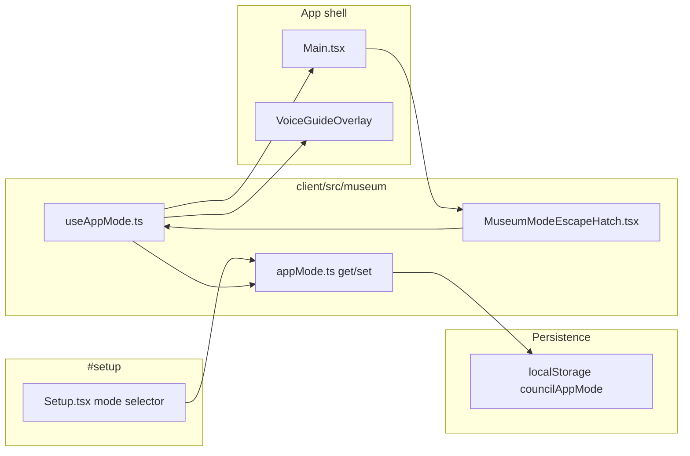
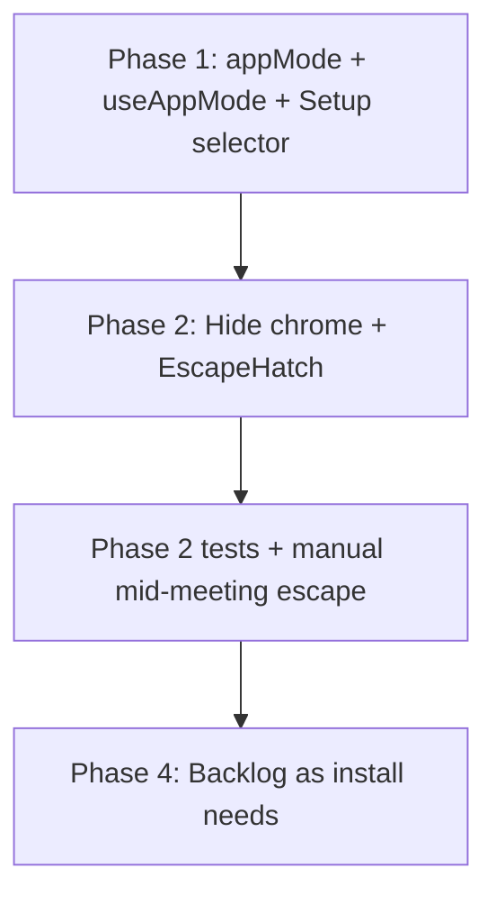

# Museum Mode — long-term development plan

This document tracks the **intent**, **architecture**, and **implementation status** of **Museum Mode**: a client-side app mode for physical installations (museums, kiosks) where visitors have no mouse or keyboard and interact via voice. **Web mode** is the default for online viewing.

**How to read this doc:** Sections distinguish **goals**, **what ships in each phase**, **gaps** (mouse-free council, etc.), and **decisions** already made. Update the *Implementation status* section as work lands.

---

## Goals

- **Two app modes:** `web` (default) and `museum`, chosen on `#setup` and persisted in `localStorage`.
- **Museum chrome removal:** Hide staff/visitor UI chrome so the install looks like a passive, voice-guided experience.
- **Live mode switching:** Exiting museum mode (escape hatch) restores all web controls **without reload**, so staff can recover mid-meeting during development or install tuning.
- **Voice-first setup:** Pre-meeting flow is already driven by the voice guide (`MeetingVoiceGuide`); museum mode optimizes for that path.
- **Kiosk ops:** Fullscreen is handled outside the app (Chrome fullscreen / OS kiosk), not via `requestFullscreen()` in code.

### Non-goals (for initial phases)

- Lazy-loading or code-splitting navbar away from museum kiosks (conditional render is enough).
- Auto-selecting push-to-talk when museum mode is enabled (PTT vs always-on stays a separate `#setup` choice).
- Programmatic browser fullscreen on museum mount.
- A voice moderator during the live council meeting (unchanged from voice-guide migration plan).

---

## Decisions (locked in)

| Topic | Decision |
|-------|----------|
| Storage | `localStorage`, same pattern as `councilPushToTalk` in `councilSettings.ts` |
| Storage key | `councilAppMode` — values `"web"` \| `"museum"`, default `"web"` |
| Museum code location | New folder: `client/src/museum/` |
| Navbar | Conditionally not rendered in museum mode (component may still be in the bundle) |
| FullscreenButton | Hidden in museum mode; staff use Chrome / OS fullscreen for installs |
| AI (voice guide) toggle | Hidden in museum mode; guide keeps auto-starting via `useVoiceGuide` |
| Escape hatch | Single click; top-left; lives in `client/src/museum/`; **no page reload** |
| PTT | Independent of museum mode — do not auto-enable push-to-talk |
| Mode reactivity | `useAppMode()` hook so toggling mode or escape hatch updates UI in place |

---

## Architecture overview



**Reactive mode:** Components that hide or show chrome must use `useAppMode()` (or receive `isMuseumMode` from a parent that does). Do not call `getAppMode()` only at module scope — that will not re-render when the escape hatch fires mid-meeting.

**Escape hatch flow:**

1. User/staff clicks invisible top-left hit target.
2. `setAppMode("web")` via `useAppMode()`.
3. `Main` mounts `Navbar`, `FullscreenButton`; `VoiceGuideOverlay` shows AI toggle; escape hatch unmounts.
4. Meeting route, socket state, voice guide session, and council playback continue unchanged.

---

## Phase 1 — Foundation (ship first)

### 1.1 `client/src/museum/appMode.ts`

- `export type AppMode = "web" | "museum"`
- `getAppMode(): AppMode` — read `localStorage`, default `"web"`
- `setAppMode(mode: AppMode): void` — write `localStorage`, swallow errors (private mode, etc.)
- Unit tests: `client/tests/unit/museum/appMode.test.ts`

Keep `councilSettings.ts` focused on push-to-talk only; museum persistence lives under `src/museum`.

### 1.2 `client/src/museum/useAppMode.ts`

```ts
// Returns [mode, setMode] or { mode, isMuseumMode, setAppMode }
// useState(getAppMode) + setAppMode wrapper that updates state
// Optional: window "storage" listener for cross-tab sync
```

Export `isMuseumMode` helper: `mode === "museum"`.

### 1.3 Setup page — Mode selector

**File:** `client/src/main/overlay/Setup.tsx`

Add at the **top** of the overlay (above “Voice Guide”):

```
Mode
[ Web ]  [ Museum ]
```

- Same two-column grid and `selected` class as push-to-talk.
- `data-testid="app-mode-web"` / `app-mode-museum`
- Uses `useAppMode()` from `@/museum/useAppMode`
- i18n keys: `setup.mode`, `setup.web`, `setup.museum`

**Tests:** extend `client/tests/unit/components/Setup.test.tsx`.

**Locales:** `client/src/locales/**` (en + sv as applicable).

### 1.4 Phase 1 exit criteria

- [x] Mode persists across reload
- [x] `#setup` can switch web ↔ museum
- [x] `useAppMode` is the single reactive API for mode

---

## Phase 2 — Hide UI chrome

### 2.1 `client/src/main/Main.tsx`

Use `const { isMuseumMode } = useAppMode()` (or equivalent).

| Element | Web | Museum |
|---------|-----|--------|
| `<Navbar />` | render | **do not render** |
| Hamburger backdrop (`hamburgerCloserStyle`) | when open | skip (no navbar) |
| `<FullscreenButton />` | `!isIphone` | `!isIphone && !isMuseumMode` |
| `<MuseumModeEscapeHatch />` | — | render when `isMuseumMode` |

No `requestFullscreen()` or auto-fullscreen logic.

### 2.2 `client/src/voice/VoiceGuideOverlay.tsx`

- Accept `isMuseumMode?: boolean` (from `MeetingVoiceGuide` → `useAppMode()`).
- When `isMuseumMode`: do not render the bottom-left AI start/stop `ConversationControlIcon` (or loading spinner slot tied to manual start).
- Voice guide continues to auto-start (`useVoiceGuide` default `autoStart: true`); visitors cannot stop the session from the UI.

### 2.3 `client/src/museum/MuseumModeEscapeHatch.tsx`

| Property | Value |
|----------|--------|
| Position | `fixed`, top-left |
| Hit area | ~48×48px (tunable) |
| Appearance | Transparent / `opacity: 0` — no visible chrome |
| Activation | **Single click** |
| Action | `setAppMode("web")` only — **no** `location.reload()` |
| z-index | High enough to receive clicks above scene content |
| test id | `museum-mode-escape` |

Renders only when `isMuseumMode`.

**Tests:** `client/tests/unit/museum/MuseumModeEscapeHatch.test.tsx` — click sets mode to web, does not reload.

### 2.4 Phase 2 exit criteria

- [x] Museum: no navbar, no fullscreen button, no AI toggle
- [x] Web: all three present (subject to existing `isIphone` fullscreen rule)
- [x] Escape hatch mid-meeting restores navbar + controls without losing meeting state
- [x] `RouterLogic` / `Main` tests updated for conditional chrome

---

## Phase 3 — Mouse-free analysis (reference)

Use this section when prioritising later work. Phase 1–2 do **not** require council-phase voice work.

### Already workable without mouse (pre-meeting)

| Step | Voice path | Visual UI (redundant in museum) |
|------|------------|----------------------------------|
| Landing | `begin_setup` | “Let’s go!” link (`Landing.tsx`) |
| Topic | `preview_topic`, `commit_topic`, `set_custom_topic` | `SelectTopic` buttons + Next |
| Characters | select/deselect tools, `start_meeting` | `SelectCharacters` + Start |
| Visitor name | `remember_visitor_name` | — |

PTT + Web Serial talk button (`#setup` serial section) supports hardware input when push-to-talk is enabled — independent of museum mode.

### Still mouse-dependent (council / errors)

| Area | Controls | Risk for museum |
|------|----------|-----------------|
| Playback | `ConversationControls` — pause, skip, mute, raise hand | High |
| Human input | `HumanInput` — record, submit | High |
| Overlays | `Name`, `Completed`, `Incomplete`, `Summary` | Medium |
| Errors | `CouncilError`, `Reconnecting` | Medium |
| Hash overlays | `#about`, `#contact` (URL only; no navbar in museum) | Low |
| Hover tooltips | Topic/character hover on setup screens | None (cosmetic) |

**Conclusion:** Museum mode Phase 2 is **install chrome + escape hatch**. A passive “watch the council” install may work without Phase 4 if visitors rarely need raise-hand or human_input. Interactive installs need Phase 4.

---

## Phase 4 — Museum UX hardening (backlog)

Pick items based on install requirements. None are required for Phase 1–2 ship.

### 4.1 Setup presentation (optional)

- [x] Museum landing: hide “Let’s go!” and description; show existing `Loading` while voice guide connects (`MeetingVoiceGuide`).
- [x] `SelectTopic`: hide Next in museum mode.
- [x] `SelectCharacters`: hide Start/randomize row and add-human button in museum mode.
- Keep screens as visual feedback mirroring voice-driven state.

### 4.2 Council passive mode (optional)

- Hide `ConversationControls` when `isMuseumMode`.
- Auto-advance or timed defaults on `Completed` / `Incomplete` overlays.
- Skip `Name` overlay when `visitorName` already set from voice guide.

### 4.3 Human input without mouse (optional)

- On `human_input` / `human_panelist`: auto-start mic, voice-only submit (extend `HumanInput` realtime path).
- Or expose council actions via a future voice agent (large effort; see voice-guide migration plan non-goals).

### 4.4 Block incidental hash overlays (optional)

In `MainOverlays`, if `isMuseumMode` and hash is `#about` | `#contact`, auto-close. Keep `#setup` for staff.

### 4.5 Install ops (documentation)

- Set mode on `#setup` before opening to public.
- Chrome fullscreen / kiosk profile for the display machine.
- Connect serial talk button when using push-to-talk.
- Optional: `?mode=museum` on first load to seed `localStorage` (installer script) — not in scope unless requested.

### 4.6 Idle reset (future)

Return to landing after inactivity — separate feature; coordinate with voice guide teardown.

---

## File map

| Path | Role |
|------|------|
| `client/src/museum/appMode.ts` | `getAppMode` / `setAppMode` |
| `client/src/museum/useAppMode.ts` | Reactive hook for components |
| `client/src/museum/MuseumModeEscapeHatch.tsx` | Single-click exit to web mode |
| `client/src/main/overlay/Setup.tsx` | Mode selector at top |
| `client/src/main/Main.tsx` | Conditional navbar, fullscreen, escape hatch |
| `client/src/voice/MeetingVoiceGuide.tsx` | Pass `isMuseumMode` to overlay |
| `client/src/voice/VoiceGuideOverlay.tsx` | Hide AI control in museum |
| `client/tests/unit/museum/appMode.test.ts` | Storage tests |
| `client/tests/unit/museum/MuseumModeEscapeHatch.test.tsx` | Escape hatch tests |
| `client/tests/unit/components/Setup.test.tsx` | Mode selector tests |

---

## Implementation order



**Target for first PR:** Phase 1 + Phase 2 + tests.

---

## Test plan

### Automated

1. `appMode` — default web; museum persists; invalid/missing key falls back to web.
2. `Setup` — mode toggle UI and `localStorage` writes.
3. `MuseumModeEscapeHatch` — visible only in museum; one click → web mode; no navigation/reload mock triggered.
4. `Main` / router tests — navbar and fullscreen absent when museum (mock `useAppMode`).

### Manual

1. `#setup` → Museum → reload → chrome still hidden.
2. Start meeting in museum mode → click escape hatch → navbar, fullscreen, AI button appear; meeting continues.
3. `#setup` → Web → full chrome restored.
4. Museum + Always On voice guide → setup completable by voice only.
5. Museum + Push to Talk + serial button → hold-to-speak flow unchanged.

---

## Open questions (for Phase 4)

1. Should council controls be hidden in museum mode for all installs, or only when a flag is set?
2. Is raise-hand / human participation required in the museum build?
3. Should we hide setup “Next” / “Start” buttons in museum mode for a cleaner visual?
4. Idle timeout and return-to-landing for the next visitor?

---

## Changelog

| Date | Change |
|------|--------|
| 2026-06-08 | Initial plan: `src/museum` folder, live escape (no reload), no PTT auto-select, no JS fullscreen, single-click escape hatch |
| 2026-06-08 | Phase 1–2 implemented: `appMode`, `useAppMode`, Setup selector, conditional chrome, escape hatch, tests |
