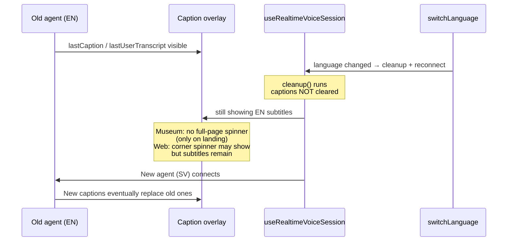

# Voice guide language-switch UI reset — plan

When the visitor switches language via `switch_language`, the voice guide tears down the old WebRTC session and reconnects with a new bootstrap (voice, STT, TTS). Today the **old subtitles stay on screen** during and after that transition, and the **loading affordances are incomplete** — especially in museum mode after the landing step.

This document tracks the fix.

---

## Problem



### Observed behaviour

| Mode | Expected | Actual |
|------|----------|--------|
| Museum | Full-page `<Loading />` during reconnect (like initial page load) | Spinner only on **landing** phase (`showMuseumLandingLoading`); topic/character steps show stale subtitles with no full-page loader |
| Web | Corner loading spinner + no stale subtitles | Corner spinner shows when `isConnecting`, but **old subtitles remain visible** underneath |

---

## Root cause

Subtitles live in `useRealtimeVoiceSession` state (`lastCaption`, `lastUserTranscript`). They are cleared by `resetSessionUiState()`, but that function is only called when `sessionActive` becomes `false` (user stops the guide):

```551:564:client/src/realtime/useRealtimeVoiceSession.ts
  useEffect(() => {
    if (!sessionActive) {
      cleanup();
      setConnectionState("idle");
      resetSessionUiState();
      return;
    }
    if (!autoConnect) return;
    void start();
    return () => {
      cleanup();
      setConnectionState("idle");
    };
  }, [sessionActive, autoConnect, start, cleanup, resetSessionUiState]);
```

Language switch keeps `sessionActive === true`. The effect re-runs because `start` depends on `language`. The **cleanup return path does not call `resetSessionUiState()`**, and `start()` only clears `error` / `hasReceivedAudioPart` — not captions.

`RealtimeCaptionOverlay` renders whenever `lastCaption || lastUserTranscript` is truthy; it has no awareness of reconnect:

```108:120:client/src/realtime/RealtimeCaptionOverlay.tsx
  const hasText = Boolean(lastUserTranscript || lastCaption);
  ...
        {hasText ? (
```

Museum full-page loading is gated to landing only:

```126:127:client/src/voice/MeetingVoiceGuide.tsx
  const showMuseumLandingLoading =
    isMuseumMode && phase === "landing" && !muted && voice.isConnecting;
```

---

## Goals

- On any voice-guide reconnect (language switch, and consistently for other reconnect triggers), **clear stale subtitles immediately**.
- **Museum mode:** show full-page `<Loading />` whenever the guide is reconnecting and the session is active — at any wizard phase.
- **Web mode:** keep the existing corner Lottie spinner on the AI toggle; **hide subtitles** while reconnecting.
- Fix at the shared session layer where possible so meta-agent and future realtime consumers benefit too.

### Non-goals

- Custom “Switching to Swedish…” copy (generic loading is enough).
- Persisting partial conversation across language switch.
- Changes to the live council meeting (voice guide unmounts when the meeting starts).

---

## Decisions

| Topic | Decision |
|-------|----------|
| Where to clear captions | **`useRealtimeVoiceSession`** — call `resetSessionUiState()` on reconnect teardown and at the top of `start()`. Single source of truth for all reconnect reasons. |
| Defensive UI hide | **`RealtimeCaptionOverlay`** — accept optional `hideCaptions?: boolean` (or `isConnecting`) and suppress text while true, even if state hasn't flushed yet. |
| Museum loading scope | Rename / broaden `showMuseumLandingLoading` → `showMuseumReconnecting`: `isMuseumMode && !muted && voice.isConnecting` (drop `phase === "landing"`). |
| Web loading | No new UI — existing corner spinner in `VoiceGuideOverlay` is sufficient once captions are hidden. |
| `isConnecting` definition | Keep current `useVoiceGuide` definition (`connecting` or `ready` awaiting first audio). It already covers the reconnect window. |

---

## Implementation plan

### 1. Reset session UI on reconnect — `useRealtimeVoiceSession.ts`

**Change the session-active effect cleanup:**

```typescript
return () => {
  cleanup();
  resetSessionUiState();
  setConnectionState("idle");
};
```

**Also call `resetSessionUiState()` at the start of `start()`** (before `setConnectionState("connecting")`) so captions clear even if cleanup ordering races in StrictMode.

This fixes language switch and any other reconnect where `start`'s dependencies change while `sessionActive` stays true (e.g. PTT toggle changing `pttMic` in the `start` deps).

### 2. Hide captions while connecting — `RealtimeCaptionOverlay.tsx`

Add prop:

```typescript
hideCaptions?: boolean;
```

When `hideCaptions` is true, treat `hasText` as false (still show `error` if present). Keeps the overlay from flashing stale text for a frame before React state updates.

Wire from `VoiceGuideOverlay`:

```typescript
<RealtimeCaptionOverlay
  ...
  hideCaptions={isConnecting}
/>
```

Meta-agent can pass the same if desired (`connectionState === "connecting"`).

### 3. Museum full-page loading — `MeetingVoiceGuide.tsx`

```typescript
const showMuseumReconnecting =
  isMuseumMode && !muted && voice.isConnecting;
```

Render `<Loading />` when true (any phase). Remove the landing-only gate.

### 4. Tests

| Test | File |
|------|------|
| `resetSessionUiState` clears captions when effect cleanup runs on `start` identity change | `client/tests/unit/realtime/useRealtimeVoiceSession.test.ts` (new or extend if exists) |
| `RealtimeCaptionOverlay` hides text when `hideCaptions` | `client/tests/unit/realtime/RealtimeCaptionOverlay.test.tsx` |
| `buildGuidePrompt` / guide tools — no change needed | — |

If a dedicated session hook test is heavy, a lighter option is a focused unit test on a small extracted `shouldHideCaptions(isConnecting, lastCaption)` helper — prefer testing behaviour through the overlay component.

### 5. Manual test plan

1. **Forest, museum mode, EN → SV via voice** on landing: full-page spinner, no EN subtitles, SV greeting appears.
2. Same switch on **topic step** and **character step**: full-page spinner (not just corner).
3. **Web mode** switch: corner spinner on AI icon, subtitles cleared during reconnect.
4. **Foods branch** (single language): no `switch_language` tool; confirm normal reconnect paths (e.g. PTT mode toggle) also clear captions if they trigger reconnect.
5. Stop/start guide manually (web): subtitles clear on stop (already works) and on restart.

---

## File touch list

| File | Change |
|------|--------|
| `client/src/realtime/useRealtimeVoiceSession.ts` | `resetSessionUiState()` in effect cleanup + `start()` |
| `client/src/realtime/RealtimeCaptionOverlay.tsx` | `hideCaptions` prop |
| `client/src/voice/VoiceGuideOverlay.tsx` | Pass `hideCaptions={isConnecting}` |
| `client/src/voice/MeetingVoiceGuide.tsx` | Broaden museum loading condition |
| Tests | Overlay + session reset coverage |

---

## Implementation status

| Item | Status |
|------|--------|
| Session UI reset on reconnect | Done |
| `hideCaptions` on caption overlay | Done |
| Museum loading at all phases | Done |
| Tests | Done |

---

## References

- `docs/voice-guide-switch-language-plan.md` — `switch_language` tool and routing
- `client/src/voice/useVoiceGuide.ts` — `isConnecting` derivation
- `client/src/voice/VoiceGuideOverlay.tsx` — web corner spinner
- `client/src/main/Loading.tsx` — museum full-page spinner
