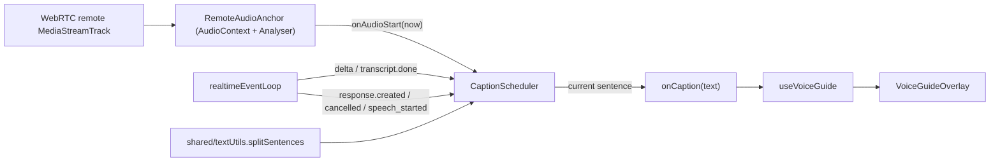

# Voice Guide Subtitle Pacing Plan

## Overview

Replace the "wait for full transcript, dump it on screen" caption flow in the voice guide with a streaming, sentence-by-sentence subtitle that begins as soon as audio actually starts playing. Pace subtitles using a character-count heuristic scaled by the configured TTS speed, and anchor the start moment to the remote WebRTC track via the Web Audio API.

## Background: What The Realtime Stream Gives Us

From [client/voice-guide-session-2026-04-28T15-17-31-110Z.jsonl](../client/voice-guide-session-2026-04-28T15-17-31-110Z.jsonl) and the [Inworld WebRTC docs](https://docs.inworld.ai/api-reference/realtimeAPI/realtime/realtime-webrtc):

- `response.output_audio_transcript.delta` events arrive in bursts within microseconds of each other, well before audio plays. Example: three deltas covering a full 50-word response all land at `t=80288.7-80288.9ms`, but the audio plays for the next ~12 seconds.
- `response.output_audio.delta` is not sent on WebRTC. Audio comes through a media track, so there is no per-chunk audio-arrival timestamp on the data channel.
- The closest data-channel anchor for "audio starts now-ish" is `response.content_part.added` with `part.type === "audio"`, which lands ~300 ms after the first transcript delta and ~100-200 ms before the user actually hears anything.
- `response.output_audio.done` fires when the server finished sending audio, often only ~300 ms after audio is added. It is not the moment audio finishes playing locally.

Conclusion: there is no native sentence-to-audio mapping. We pace heuristically, but anchor the schedule to the actual remote audio track.

## Architecture



## Pacing Algorithm

For each sentence, display duration is:

```ts
durationMs = max(MIN_DURATION_MS, sentence.length / (BASE_CPS * speed) * 1000)
```

- `BASE_CPS` = 14 chars/sec (English, Pippa-ish). Centralized constant, easy to tune.
- `speed` = `audio.output.speed` from server defaults (1.1 today).
- `MIN_DURATION_MS` = 800 ms to avoid flashing very short sentences.

Sentence reveal schedule:

- Sentence 0 starts at `audioAnchorTs`.
- Sentence N starts at `audioAnchorTs + sum(duration(sentence_i, i < N))`.
- If a sentence becomes available after its scheduled slot (slow LLM), show it immediately.
- If the audio anchor is not set yet when sentences arrive, queue them; once the anchor lands, schedule from "now".

Pacing slightly faster than the audio is fine: subtitles leading a little is acceptable. Pacing slower is what we are explicitly fixing.

## Files

- New: [client/src/voice/captionScheduler.ts](../client/src/voice/captionScheduler.ts) - pure module, no React.
- New: [client/src/voice/remoteAudioAnchor.ts](../client/src/voice/remoteAudioAnchor.ts) - AudioContext-based audio-onset detector for the remote WebRTC track.
- Move: [server/src/utils/textUtils.ts](../server/src/utils/textUtils.ts) -> [shared/textUtils.ts](../shared/textUtils.ts) so the client and server share one `splitSentences`.
- Edit: [client/src/voice/realtimeEventLoop.ts](../client/src/voice/realtimeEventLoop.ts) - wire scheduler into the event handlers.
- Edit: [client/src/voice/useVoiceGuide.ts](../client/src/voice/useVoiceGuide.ts) - pass the configured `speed` into the scheduler; create the audio anchor when the remote track arrives.
- Update imports in the server files currently importing from `@utils/textUtils.js`.

## Sentence Buffering

In `shared/textUtils.ts`, `splitSentences` matches a trailing fragment as a sentence via the `|$` alternative, so we cannot just feed it the running buffer. The scheduler will:

1. Accumulate deltas into `buffer`.
2. Find the index of the last terminal char in `buffer` (`/[.!?…;\n]/g`, take last match).
3. Run `splitSentences` on `buffer.slice(0, lastTermIdx + 1)` to produce `committedSentences`.
4. Use `committedSentences.slice(emittedCount)` as new sentences and bump `emittedCount`.
5. On `response.output_audio_transcript.done`, run `splitSentences` on the full canonical `transcript` and push any still-unemitted sentences. This handles the trailing fragment without terminal punctuation.

## Event-Loop Wiring

In [client/src/voice/realtimeEventLoop.ts](../client/src/voice/realtimeEventLoop.ts):

- `response.created` -> `scheduler.beginResponse()` (reset buffer, queue, anchor; arms the audio anchor for the next onset).
- `response.output_audio_transcript.delta` -> `scheduler.appendDelta(delta)`.
- `response.output_audio_transcript.done` -> `scheduler.finalize(transcript)`. Stop swapping `onCaption` to the full transcript here; the scheduler drives `onCaption` per sentence.
- `response.done` with `status === "cancelled"` -> `scheduler.cancel()`.
- `input_audio_buffer.speech_started` -> `scheduler.cancel()` (with `interrupt_response: true`, the assistant gets cut off as soon as the user starts speaking).
- `conversation.item.input_audio_transcription.completed` -> keep existing `onCaption(null)` clear.

The primary audio anchor (`scheduler.setAudioAnchor(now)`) comes from `RemoteAudioAnchor` observing the actual track. `content_part.added` is only used as a safety fallback: if the analyser does not fire shortly after the audio content part appears, the scheduler anchors from `performance.now()` so captions never stall indefinitely.

The scheduler emits caption changes through the existing `callbacks.onCaption(text)`, so `useVoiceGuide` and `VoiceGuideOverlay` need no UI changes. They just receive shorter strings, more often.

## CaptionScheduler API

```ts
type CaptionScheduler = {
  beginResponse(): void;
  appendDelta(delta: string): void;
  finalize(transcript: string): void;
  setAudioAnchor(now: number): void;
  cancel(): void;
  setSpeed(speed: number): void;
};

createCaptionScheduler(opts: {
  onCaption: (text: string | null) => void;
  baseCharsPerSec?: number;
  minDurationMs?: number;
  now?: () => number;
  setTimeoutFn?: typeof setTimeout;
}): CaptionScheduler;
```

Internally it owns a sentence queue, a single in-flight `setTimeout`, and an `emittedCount` cursor. `cancel()` clears the timeout and calls `onCaption(null)`.

## RemoteAudioAnchor API

In [client/src/voice/remoteAudioAnchor.ts](../client/src/voice/remoteAudioAnchor.ts):

```ts
type RemoteAudioAnchor = {
  /** Arm for the next onset; called from scheduler.beginResponse(). */
  arm(): void;
  /** Stop the RAF loop and release the AudioContext / nodes. */
  dispose(): void;
};

createRemoteAudioAnchor(opts: {
  track: MediaStreamTrack;
  onAudioStart: (now: number) => void;
  /** RMS threshold (0..1) below which we treat the track as silent. Default 0.01. */
  silenceThreshold?: number;
  /** How long below threshold counts as "quiet" before re-arming. Default 250ms. */
  silenceMs?: number;
  log?: (...args: unknown[]) => void;
}): RemoteAudioAnchor;
```

Implementation, mirroring the existing pattern in [LiveAudioVisualizer.tsx](../client/src/components/LiveAudioVisualizer.tsx):

- Create `AudioContext`, `MediaStreamAudioSourceNode`, and `AnalyserNode`.
- Connect source -> analyser; do not connect to `ctx.destination`. Playback is still owned by the existing `<audio>` element, so we do not double-play the audio.
- RAF loop computes RMS from `analyser.getByteTimeDomainData()`, centered around 128.
- State machine: `armed -> fired -> quiet -> armed`.
- `arm()` resets to `armed`.
- `armed && rms > threshold` calls `onAudioStart(performance.now())` and switches to `fired`.
- `fired && rms < threshold` for `silenceMs` switches to `quiet`, ready to re-arm on the next response.
- `scheduler.beginResponse()` calls `audioAnchor.arm()` so the next response's audio onset re-fires `setAudioAnchor`.

Caveat: in some Chromium versions, `MediaStreamAudioSourceNode` from a remote WebRTC track only delivers samples if connected to `destination`. If we hit silent analyser data on Chrome, the current implementation falls back to the data-channel audio-content event. If that fallback is visibly off, the next refinement is muting the `<audio>` element and routing playback through `ctx.destination`.

Ownership: the anchor lives for the lifetime of the remote track. It is created in [useVoiceGuide.ts](../client/src/voice/useVoiceGuide.ts) inside `attachRemoteAudio` and disposed when the connection closes or the track ends.

## Implementation Tasks

1. Move `splitSentences`, `Word`, and `MappedSentence` from `server/src/utils/textUtils.ts` to `shared/textUtils.ts`; update the server import sites.
2. Implement `client/src/voice/captionScheduler.ts`.
3. Implement `client/src/voice/remoteAudioAnchor.ts`.
4. Wire the scheduler into `client/src/voice/realtimeEventLoop.ts`.
5. Wire the scheduler speed and remote audio anchor lifecycle into `client/src/voice/useVoiceGuide.ts`.
6. Add a unit test for `captionScheduler` using fake timers and deltas from the recorded session log.

## Out Of Scope

- Calibrating `BASE_CPS` per voice. We can later expose an override on `GlobalOptions` if 14 cps proves wrong for non-English voices.
- Silence-gap-driven sentence advance (not just audio-start anchor). This is possible using the same analyser, but only worth doing if the heuristic visibly drifts on long responses.
- Persisting/displaying full transcript history. Today only `lastCaption` is shown; that stays.

## Test Plan

- Unit: `captionScheduler` with fake `now` and fake `setTimeout`. Feed deltas from the recorded session log and assert sentence-emission ordering and timestamps.
- Manual: run the voice guide and confirm subtitles begin within ~50 ms of audio onset and advance per sentence.
- Manual: verify barge-in clears the caption when the user speaks over Pippa.
- Manual: confirm there is no double playback (one stream from `<audio>`, none from the AudioContext destination).
