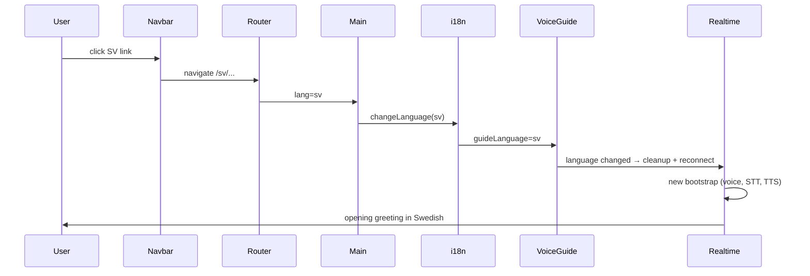

# Voice guide `switch_language` — implementation plan

This document tracks the plan for letting museum visitors switch language via the voice guide when the UI language switcher is hidden and they have no mouse or keyboard.

**How to read this doc:** Sections distinguish **goals**, **decisions**, **PR split** (prep vs feature), and **implementation steps**. Update *Implementation status* as work lands.

---

## Problem

In **museum mode**, the visitor has no mouse or keyboard. The navbar (and its language switcher) is hidden. If the installation supports more than one language (`AVAILABLE_LANGUAGES.length > 1`), the visitor currently has no way to switch language mid-setup.

On single-language deployments (e.g. the foods branch with `AVAILABLE_LANGUAGES = ["en"]`), this is not a concern — the agent should be unaware that other languages exist.

---

## Goals

- Add a `switch_language` tool to the voice guide so the agent can switch the visitor to another available language on request.
- The agent should mention, when natural, that the visitor may continue in the other language(s) (e.g. Swedish or English).
- Calling the tool switches language, which tears down the current realtime session and reconnects with the new language, voice, and STT/TTS config.
- On single-language deployments, do **not** register the tool and do **not** mention other languages in the prompt.

### Non-goals

- Switching language during a live council meeting (out of scope; voice guide unmounts when the meeting starts).
- Persisting a language preference across sessions (URL + i18n already handle the current session).
- A custom “switching…” UI beyond the existing museum landing loading state.

---

## Decisions (locked in)

| Topic | Decision |
|-------|----------|
| Switch mechanism | Reuse the existing URL-based language switch (`/en/...` ↔ `/sv/...`). This already drives `i18n.changeLanguage` and voice-guide reconnect via `useRealtimeVoiceSession`’s `language` dependency. |
| Shared routing helper | Extract `switchLanguagePath` / `useSwitchLanguage` into `client/src/routing.ts` so Navbar, voice guide, and future callers share one implementation. |
| Tool parameter | `language: string` with JSON Schema `enum` of valid target codes (not a blind toggle). Generalizes to >2 languages and matches existing id-based tools. |
| Tool availability | Only when `AVAILABLE_LANGUAGES.length > 1`. Compute `otherLanguages = AVAILABLE_LANGUAGES.filter(l => l !== currentLang)`. |
| Post-tool behavior | Return `{ ok: true, suppressContinuation: true }` — the session is about to tear down; don’t let the outgoing agent start a new response. |
| Spoken language names | Per-locale display names in voice-guide JSON (`languageNames`), e.g. English bundle: `{ "en": "English", "sv": "Swedish" }`, Swedish bundle: `{ "en": "engelska", "sv": "svenska" }`. |
| Museum-only? | No — the tool is useful in web mode too when the navbar is collapsed or on small screens, but the primary driver is museum mode. No mode gate on the tool itself. |

---

## How language switching works today



**Key files:**

| File | Role |
|------|------|
| `shared/AvailableLanguages.ts` | Canonical `AVAILABLE_LANGUAGES` array |
| `client/src/routing.ts` | `stripLanguagePrefix`, `useRouting` |
| `client/src/main/Navbar.tsx` | Inline `Link to={/${l}/...}` (to be refactored) |
| `client/src/main/Main.tsx` | Syncs `props.lang` → `i18n.changeLanguage` |
| `client/src/voice/MeetingVoiceGuide.tsx` | Derives `guideLanguage`, wires voice session |
| `client/src/realtime/useRealtimeVoiceSession.ts` | Reconnects when `language` changes |

**Navbar today** (duplicated path logic):

```tsx
to={`/${l}/${stripLanguagePrefix(location.pathname).replace(/^\//, '')}${location.hash}`}
```

---

## PR split

### PR 1 — Prep: shared `switchLanguage` in routing (small, standalone)

**Goal:** One canonical way to build a language-switched path and navigate to it. No voice-guide changes.

**Changes:**

1. **`client/src/routing.ts`**
   - Add `buildLanguagePath(targetLang, pathname, hash?)` — returns the full path for a language switch, preserving the current route and hash.
   - Add `useSwitchLanguage()` hook — returns `{ switchLanguage, otherLanguages, canSwitchLanguage }`:
     - `switchLanguage(targetLang)` — calls `navigate(buildLanguagePath(...))`.
     - `otherLanguages` — `AVAILABLE_LANGUAGES` minus current `i18n.language` (normalized).
     - `canSwitchLanguage` — `AVAILABLE_LANGUAGES.length > 1`.
   - Normalize language codes consistently with existing code (`sv` prefix → `"sv"`, else `"en"` or first available).

2. **`client/src/main/Navbar.tsx`**
   - Replace inline `Link to={...}` with `to={buildLanguagePath(l, location.pathname, location.hash)}` (or `switchLanguage` on click if preferred; `Link` is fine for SEO/accessibility).

3. **Tests** (optional but recommended)
   - Unit test `buildLanguagePath` for `/en/new-meeting` → `/sv/new-meeting`, root paths, hash preservation, single-language mode (no prefix).

**Acceptance criteria:**

- Navbar language links behave exactly as before.
- `buildLanguagePath` / `useSwitchLanguage` are exported and ready for PR 2.
- No change to voice guide behavior.

---

### PR 2 — Feature: `switch_language` voice guide tool

**Goal:** Museum visitors (and others) can ask the voice guide to switch language.

**Changes:**

1. **`client/src/voice/guideTools.ts`**
   - Extend `createGuideTools` params: `otherLanguages: string[]`.
   - When `otherLanguages.length > 0`, append `switch_language` tool:
     - `parameters.language`: `{ type: "string", enum: otherLanguages }`, required.
     - Description from prompt bundle `toolDescriptions.switch_language`.
   - Extend `GuideToolContext`: `switchLanguage`, `otherLanguages`.
   - Handler: validate `language ∈ otherLanguages`, call `ctx.switchLanguage(language)`, return `{ ok: true, suppressContinuation: true }`.

2. **`client/src/voice/guidePrompt.ts`**
   - Extend `BuildGuidePromptParams`: `otherLanguageNames?: string[]`.
   - When non-empty, append a short prompt section:
     - The visitor may continue in {names}.
     - If they ask to switch, call `switch_language` with the target code.
   - When empty, add nothing (single-language deploys).

3. **`client/src/voice/MeetingVoiceGuide.tsx`**
   - Use `useSwitchLanguage()` from routing.
   - Pass `otherLanguages` into `createGuideTools` and `createGuideToolHandlers`.
   - Map `otherLanguages` → spoken names via `promptBundle.languageNames` for `buildGuidePrompt`.

4. **Prompt JSON** — `shared/prompts/voice_guide_beings_en.json` and `voice_guide_beings_sv.json`:
   - Add `languageNames: { "en": "...", "sv": "..." }`.
   - Add `toolDescriptions.switch_language`.
   - Add one job-instruction bullet on landing (museum-appropriate): mention the language option when natural, especially early in the welcome.

5. **`client/src/voice/guidePrompt.ts` type**
   - Extend `VoiceGuidePromptBundle` with `languageNames: Record<string, string>`.

6. **Tests**
   - `createGuideTools({ otherLanguages: [] })` does not include `switch_language`.
   - `createGuideTools({ otherLanguages: ["sv"] })` includes tool with `enum: ["sv"]`.
   - Handler rejects unknown language; calls `switchLanguage` on valid input.
   - `buildGuidePrompt` omits language section when `otherLanguageNames` is empty.

**Acceptance criteria:**

- In museum mode with `["en", "sv"]`, agent can offer and execute a language switch.
- After switch, voice guide reconnects in the new language with a fresh greeting.
- Setup state (topic, characters, visitor name) is preserved across the switch.
- With `AVAILABLE_LANGUAGES = ["en"]` only, no tool, no prompt mention of other languages.

---

## Implementation status

| Item | Status |
|------|--------|
| PR 1: `buildLanguagePath` + `useSwitchLanguage` in routing | Done |
| PR 1: Navbar refactor to use shared helper | Done |
| PR 2: `switch_language` tool + handler | Not started |
| PR 2: Prompt copy (en + sv JSON) | Not started |
| PR 2: `buildGuidePrompt` language section | Not started |
| PR 2: `MeetingVoiceGuide` wiring | Not started |
| Tests | PR 1 routing tests done; PR 2 pending |

---

## Edge cases

| Case | Behavior |
|------|----------|
| Single language (`foods` branch) | `otherLanguages = []` → no tool, no prompt text |
| Switch on landing | Allowed; reconnects, greeting fires again |
| Switch mid character selection | Allowed; Zustand store state preserved; UI bundles reload for new lang |
| Invalid `language` arg | Handler returns `{ ok: false, error: "..." }` |
| Already on target language | Handler returns `{ ok: false, error: "Already using that language." }` or no-op success — pick one and test |
| Hash preserved | `buildLanguagePath` includes `location.hash` (e.g. `#about` survives switch) |

---

## Future reuse of `useSwitchLanguage`

Once in routing, other callers can use the same hook:

- Navbar (PR 1)
- Voice guide tool handler (PR 2)
- Meta-agent or autoplay flows if language switching is needed later
- Any programmatic “switch to Swedish” without duplicating path math

---

## References

- `docs/museum-mode-plan.md` — museum chrome removal, voice-first setup
- `docs/voice-guide-migration-plan.md` — voice guide architecture and tool patterns
- `client/src/voice/guideTools.ts` — existing tool registration pattern
- `shared/AvailableLanguages.ts` — language list source of truth
